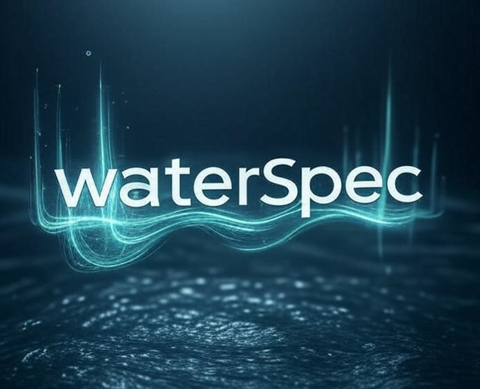

# waterSpec: Spectral Analysis of Environmental Time Series



`waterSpec` is a Python package for performing spectral analysis on environmental time series, particularly those that are irregularly sampled.

## Key Features

- **Estimate spectral slopes (β) from irregularly sampled time series**
  - **Lomb-Scargle (LS):** Best for evenly sampled data or detecting periodicities.
  - **Haar Wavelets:** Recommended for robust spectral slope estimation on unevenly sampled data.
  - Fits linear or segmented regressions (with one or two automatically detected breakpoints) on the log–log spectrum.
  - Supports uncertainty estimation with bootstrap resampling.

- **Split a time series and compare before/after a given date**
  - Quantify changes in spectral slopes across interventions, events, or management actions.
  - Test significance of changes in slope or breakpoint position.

- **Compare two different time series**
  - Directly compare spectral slopes between sites (e.g. upstream vs downstream) or variables (e.g. concentration vs discharge).
  - Includes statistical testing of differences.

- **Identify significant spectral peaks**
  - Detect narrowband oscillations or dominant periodicities.

- **Advanced Haar Analysis:**
  - **Overlapping Windows:** Maximize data usage for long-term records.
  - **Segmented Fits:** Detect regime shifts in system memory using robust regression (`MannKS`).
  - **Bivariate Analysis:** Analyze Cross-Haar correlation between Concentration and Discharge.
  - **Surrogate Testing:** Assess significance using phase-randomized or block-shuffled surrogates.
  - **Real-Time Anomaly Detection:** Compute "Sliding Haar" fluctuations to detect sudden volatility changes.
  - **Hysteresis Classification:** Quantify loop area and direction in the C-Q phase space across scales.

[]()
[]()

---

## Why Use waterSpec?

Environmental time series contain information at many timescales. `waterSpec` helps you answer questions like:

- **Is this contaminant transported by surface runoff or subsurface flow?** Different transport mechanisms leave distinct "fingerprints" in the frequency spectrum.
- **Are there hidden cycles in my data?** Detect statistically significant periodicities (seasonal, weekly, diurnal) that may not be obvious in raw plots.
- **How does temporal variability change across timescales?** Identify breakpoints where system behavior shifts from one mode to another.
- **How uncertain are my results?** Robust bootstrap confidence intervals quantify the reliability of all estimates.

The package implements methods inspired by **Liang et al. (2021)**, who used spectral analysis to characterize agricultural contaminant transport in watersheds.

---

## Installation

**Standard installation:**
```bash
git clone https://github.com/yourusername/waterSpec.git
cd waterSpec
pip install -e .
```

**Dependencies:**
`waterSpec` relies on `mannks` and `ruptures` for advanced segmented regression and changepoint detection. These are installed automatically.

**For development (includes testing dependencies):**
```bash
pip install -e '.[test]'
```

---

## Documentation

For a comprehensive step-by-step guide on using the advanced features (Haar, Bivariate, Hysteresis, Anomaly Detection), please see the **[Walkthrough Tutorial](docs/WALKTHROUGH.md)**.

---

## Quick Start

Analyze a time series in just a few lines:

```python
from waterSpec import Analysis

# Create analyzer and load data
analyzer = Analysis(
    file_path='data/nitrate_timeseries.csv',
    time_col='timestamp',
    data_col='concentration',
    param_name='Nitrate-N at Site A'
)

# Run complete analysis with automatic model selection
results = analyzer.run_full_analysis(
    output_dir='output',
    ci_method='bootstrap',
    run_haar=True,  # Enable Haar Analysis
    haar_overlap=True  # Use overlapping windows for better statistics
)

# View summary
print(results['summary_text'])
```

---

## Method Selection: Lomb-Scargle vs. Haar Wavelets

`waterSpec` provides two primary methods for spectral analysis, each with its strengths:

1.  **Lomb-Scargle Periodogram:**
    *   **Best for:** Detecting specific periodicities (peaks) in unevenly sampled data (e.g., diurnal or seasonal cycles).
    *   **Standard for:** Evenly sampled data.
    *   **Caution:** Can produce biased estimates of the spectral slope ($\beta$) if the data is highly irregular or gappy.

2.  **Haar Wavelet Analysis:**
    *   **Best for:** Estimating the spectral slope ($\beta$) on unevenly sampled data.
    *   **How it works:** Calculates the first-order structure function (average fluctuations) across different timescales (lags).
    *   **Relation to Spectrum:** The Haar fluctuation exponent $H$ is related to the spectral exponent by $\beta = 1 + 2H$.

**Recommendation:** If your primary goal is to estimate the power-law slope ($\beta$) and your data has irregular sampling steps, use the Haar method. If you are looking for specific frequency peaks, use Lomb-Scargle.

### Interpreting Haar Slopes ($m$) vs Spectral Exponents ($\beta$)

The Haar scaling exponent $m$ (slope of $\log S_1$ vs $\log \tau$) maps to the spectral exponent $\beta$.

| Haar Slope $m$ | Spectral Exponent $\beta$ | Physical Interpretation | Process Type |
| :--- | :--- | :--- | :--- |
| **-0.5** | **0.0** | White Noise (uncorrelated) | Stationary (fGn) |
| **0.0** | **1.0** | Pink Noise (1/f) | Boundary |
| **+0.5** | **2.0** | Brown Noise (Random Walk) | Non-Stationary (fBm) |

*   **Negative Slopes ($m < 0$):** Indicate stationary, mean-reverting processes (e.g., rapid flushing).
*   **Positive Slopes ($m > 0$):** Indicate non-stationary, cumulative processes (e.g., groundwater storage).

---

## Advanced Usage

### Bivariate Analysis (Cross-Haar)

Analyze the relationship between two variables (e.g., Concentration vs. Discharge) across scales.

```python
from waterSpec.bivariate import BivariateAnalysis

# Initialize with two time series
biv = BivariateAnalysis(time_c, data_c, "Conc", time_q, data_q, "Q")

# Align timestamps
biv.align_data(tolerance=3600, method='nearest') # 1 hour tolerance

# Compute Cross-Haar Correlation
results = biv.run_cross_haar_analysis(
    lags=np.logspace(3, 6, 20),
    overlap=True
)

# Calculate Hysteresis Metrics (Loop Area)
hyst_stats = biv.calculate_hysteresis_metrics(tau=86400) # 1 day scale
print(f"Loop Area: {hyst_stats['area']}, Direction: {hyst_stats['direction']}")
```

### Segmented Haar Fits

Detect regime shifts in system memory (e.g., transition from surface runoff to groundwater dominance).

```python
# In standard analysis
results = analyzer.run_full_analysis(
    ...,
    run_haar=True,
    haar_max_breakpoints=1  # Allow one breakpoint
)
```

### Real-Time Anomaly Detection (Sliding Haar)

Monitor volatility changes in real-time.

```python
from waterSpec.haar_analysis import calculate_sliding_haar

# Compute 6-hour fluctuation series
t_centers, fluctuations = calculate_sliding_haar(
    time_array, data_array, window_size=6*3600
)
```

---

## Understanding Spectral Exponents (β)

The spectral exponent β characterizes how power (variance) is distributed across frequencies:

| β Range | Scientific Meaning | Environmental Interpretation |
|---------|-------------------|------------------------------|
| **β ≈ 0** | White noise | Completely random, uncorrelated process |
| **0 < β < 1** | Fractional Gaussian noise (fGn) | **Event-driven**: storms, surface runoff, episodic inputs |
| **β ≈ 1** | Pink noise (1/f) | Balanced persistence, common in natural systems |
| **1 < β < 3** | Fractional Brownian motion (fBm) | **Storage-dominated**: groundwater, reservoir effects, strong persistence |
| **β > 3** | Black noise | Very smooth, may indicate non-stationarity |

**Typical values for water quality parameters** (from Liang et al. 2021):
- E. coli: β ≈ 0.1–0.5 (surface runoff)
- TSS: β ≈ 0.4–0.8 (surface runoff)
- Ortho-P: β ≈ 0.6–1.2 (mixed pathways)
- Nitrate-N: β ≈ 1.5–2.0 (subsurface flow)
- Chloride: β ≈ 1.3–1.7 (subsurface flow)

---

## Contributing

Contributions are welcome! Please:
1. Fork the repository
2. Create a feature branch
3. Add tests for new functionality
4. Submit a pull request

For bug reports or feature requests, please open an issue on GitHub.

---

## License

This project is licensed under the MIT License - see the LICENSE file for details.

---

## Acknowledgments

- Methodology based on Liang et al. (2021)
- Segmented regression powered by the `piecewise-regression` library
- Lomb-Scargle implementation from Astropy

---

## Support

For questions, issues, or discussions:
- 📧 Email: your.email@example.com
- 🐛 Bug reports: GitHub Issues
- 📖 Documentation: [ReadTheDocs](#) (coming soon)

---

**Start exploring the temporal structure of your environmental data today!**
