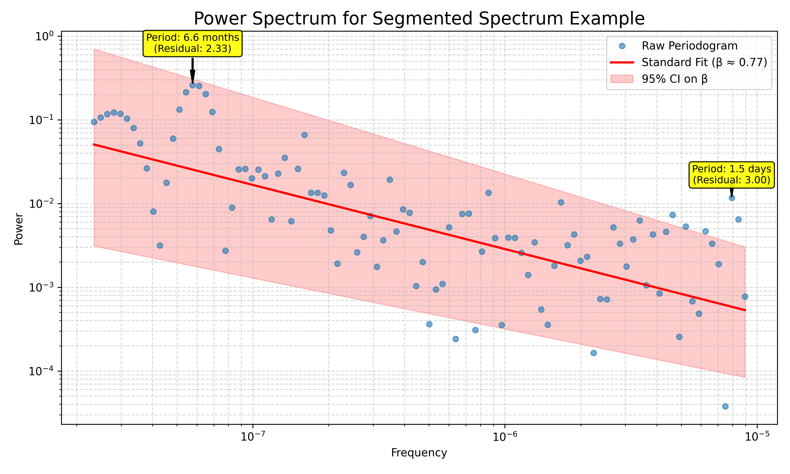
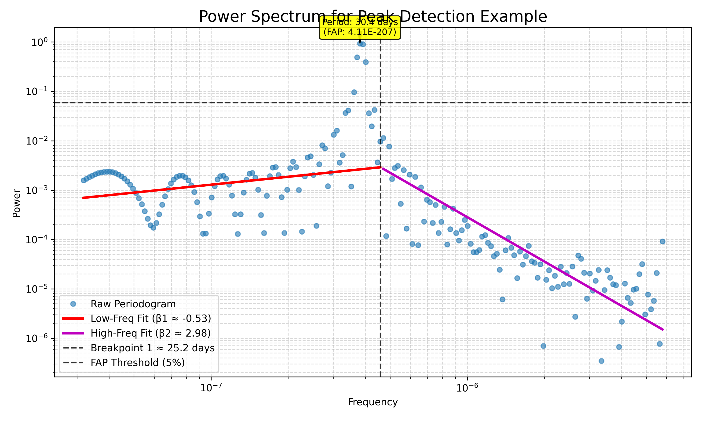
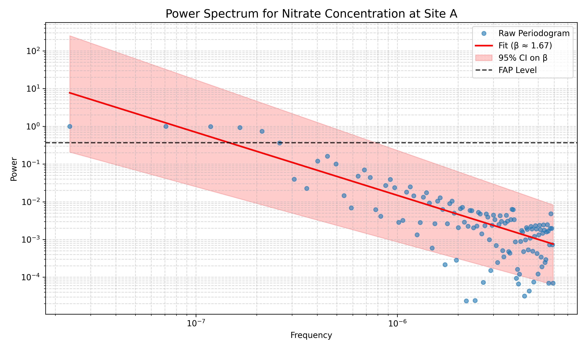

# waterSpec: Spectral Analysis of Environmental Time Series

<p align="center">
  
</p>

`waterSpec` is a Python package for performing spectral analysis on environmental time series, particularly those that are irregularly sampled. It provides a simple, powerful workflow to characterize the temporal scaling and periodic behavior of environmental data.

The methods used in this package are inspired by the work of *Liang et al. (2021)*.

## Feature 1: Spectral Power Coefficent (Beta) Estimation

A key feature of `waterSpec` is its ability to characterize the relationship between the frequency and power of a time series, which is often described by the spectral exponent, beta (β). The package can model this relationship in two ways:

1.  **Linear (Standard) Fit**: A single slope across the entire frequency range.
2.  **Segmented (Breakpoint) Fit**: Two or more slopes, indicating that the relationship changes at specific frequencies (breakpoints).

`waterSpec` automates the complex task of model selection. It fits both linear and segmented models and uses the **Bayesian Information Criterion (BIC)** to determine the most appropriate model for your data, preventing overfitting and providing a more objective analysis.

### Example: Automatic Model Selection

This example demonstrates how `waterSpec` automatically selects the best spectral model. In this case, while a segmented model was considered, the BIC score indicated that a **linear model** was the best fit for the data. This showcases the package's ability to make objective, data-driven decisions.

```python
from waterSpec import Analysis

# 1. Define the path to your data file
file_path = 'examples/segmented_data.csv'

# 2. Create the analyzer object
analyzer = Analysis(
    file_path=file_path,
    time_col='timestamp',
    data_col='value',
    param_name='Segmented Spectrum Example'
)

# 3. Run the full analysis
# We'll run a faster analysis by reducing the grid points and using parametric CIs
results = analyzer.run_full_analysis(
    output_dir='example_output',
    num_grid_points=100,      # Lower resolution for speed
    ci_method='parametric'    # Use faster CI calculation
)

# The summary text is available in the returned dictionary
print(results['summary_text'])
```

<p align="center">
  
</p>

## Feature 2: Peak Detection

`waterSpec` can identify statistically significant periodicities in your time series using either False Alarm Probability (FAP) or residual-based methods. This is useful for detecting cyclical patterns, such as seasonal or diurnal signals.

### Example: Detecting a 30-day Cycle

This example shows how to use the FAP method to find a known periodic signal in the data.

```python
from waterSpec import Analysis

# 1. Define the path to your data file
file_path = 'examples/periodic_data.csv'

# 2. Create the analyzer object
analyzer = Analysis(
    file_path=file_path,
    time_col='timestamp',
    data_col='value',
    param_name='Peak Detection Example'
)

# 3. Run the full analysis
# We'll use settings that are friendly for a quick example run
results = analyzer.run_full_analysis(
    output_dir='example_output',
    ci_method='parametric',
    peak_detection_method='fap', # Use FAP for this example
    fap_threshold=0.05
)

# The summary text is available in the returned dictionary
print(results['summary_text'])
```

<p align="center">
  
</p>

---
## Full Documentation

### Core Features

`waterSpec` provides a comprehensive and robust workflow for spectral analysis:

-   **Robust Data Loading**: Ingest time series data from CSV, Excel, or JSON files with flexible, case-insensitive column mapping.
-   **Advanced Preprocessing**: Prepare your data for analysis with a suite of tools, including log-transforms, normalization, and multiple detrending methods (linear and LOESS).
-   **Automated Model Selection**: Automatically fits and compares spectral models with 0, 1, or 2 breakpoints using the Bayesian Information Criterion (BIC) to find the best fit for your data.
-   **Comprehensive Uncertainty Analysis**: Calculates and reports 95% confidence intervals for all key parameters (spectral exponents and breakpoints) to provide a clear picture of model uncertainty.
-   **Significant Peak Detection**: Identifies statistically significant periodicities in your time series using either False Alarm Probability (FAP) or residual-based methods.
-   **Publication-Quality Outputs**: Generates high-quality plots and detailed text summaries of the analysis, ready for inclusion in reports and publications.

### Installation

This package is not yet on PyPI. To install it, clone this repository and install it in editable mode using pip.

**For standard use:**
```bash
git clone https://github.com/example/waterSpec.git
cd waterSpec
pip install -e .
```

**For development (to run the tests):**
```bash
# After cloning and changing directory:
pip install -e '.[test]'
```

### Quick Start

The recommended workflow is centered around the `waterSpec.Analysis` object. You can run a complete analysis, generating a plot and a detailed text summary, with just a few lines of code.

```python
from waterSpec import Analysis

# 1. Define the path to your data file
file_path = 'examples/sample_data.csv'

# 2. Create the analyzer object
# This loads and preprocesses the data immediately.
analyzer = Analysis(
    file_path=file_path,
    time_col='timestamp',
    data_col='concentration',
    param_name='Nitrate Concentration at Site A' # A descriptive name for plots
)

# 3. Run the full analysis
# This command runs the analysis, saves the outputs, and returns the results.
results = analyzer.run_full_analysis(
    output_dir='example_output',
    ci_method='parametric' # Use faster CI calculation for the example
)

# The summary text is available in the returned dictionary
print(results['summary_text'])
```

### Example Output

Running the code above will produce a plot (`example_output/Nitrate_Concentration_at_Site_A_spectrum_plot.png`) and a text summary (`example_output/Nitrate_Concentration_at_Site_A_summary.txt`). The summary text provides a comprehensive overview of the analysis, including a comparison of different spectral models and a list of any significant periodicities found in the data.

<p align="center">
  
</p>

### Advanced Usage

`waterSpec` provides several options to customize the analysis.

#### Data Loading Options

You can control how data is loaded by passing optional arguments to the `Analysis` constructor:

*   `time_format`: To speed up date parsing, provide the specific format of your time column (e.g., `"%Y-%m-%d %H:%M:%S"`).
*   `sheet_name`: If you are loading an Excel file, you can specify the sheet to load by its name (e.g., `"Sheet2"`) or index (e.g., `1`).
*   `verbose`: Set to `True` to enable detailed logging of the analysis process, which can be helpful for debugging. Defaults to `False`.

```python
analyzer = Analysis(
    file_path='path/to/your/data.xlsx',
    time_col='date',
    data_col='value',
    sheet_name='Water Quality Data',
    time_format='%Y-%m-%d',
    verbose=True
)
```

#### Analysis Options

The `run_full_analysis` method offers several parameters to fine-tune the spectral analysis:

*   `max_breakpoints`: Set the maximum number of breakpoints to consider for the segmented regression (e.g., `2` to compare 0, 1, and 2 breakpoint models).
*   `num_grid_points`: Control the resolution of the frequency grid (default is `200`).
*   `seed`: Provide an integer seed to ensure the bootstrap analysis for confidence intervals is reproducible.
*   `fap_method`: Choose the method for False Alarm Probability calculation. The default is `'baluev'`, which is a fast and robust analytical approximation. The `'bootstrap'` method is also available for a more traditional (but much slower) calculation.

```python
# This example runs a more detailed and reproducible analysis
results = analyzer.run_full_analysis(
    output_dir='advanced_output',
    max_breakpoints=2,
    num_grid_points=500,
    seed=42
)
print(results['summary_text'])
```

#### A Note on Confidence Intervals

`waterSpec` offers two methods for calculating confidence intervals (CIs):

-   `'bootstrap'`: A robust, non-parametric method that is recommended for final analysis. It can be computationally intensive.
-   `'parametric'`: A faster method based on statistical theory. It is suitable for initial exploration and is used in the examples in this `README` for speed.

For the most reliable results, it is recommended to use the `'bootstrap'` method.

### Dependencies and Citation

The segmented regression analysis in this package is powered by the `piecewise-regression` library. If you use the segmented model results from `waterSpec` in your research, please cite the following paper:

> Pilgrim, C. (2021). piecewise-regression (aka segmented regression) in Python. Journal of Open Source Software, 6(68), 3859. https://doi.org/10.21105/joss.03859

### Citing the Methodology

The methods used in this package are based on the following article. Please cite it if you use `waterSpec` in your research.

> Liang X, Schilling KE, Jones CS, Zhang Y-K. 2021. Temporal scaling of long-term co-occurring agricultural contaminants and the implications for conservation planning. Environmental Research Letters 16:094015.