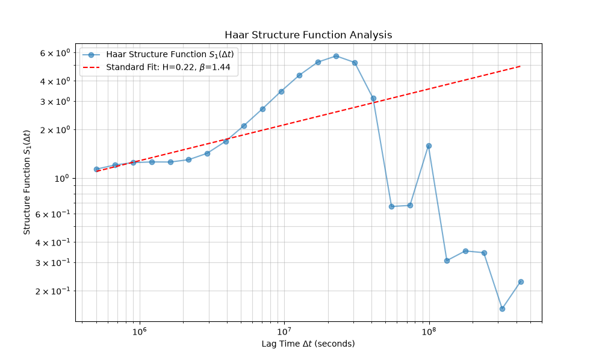
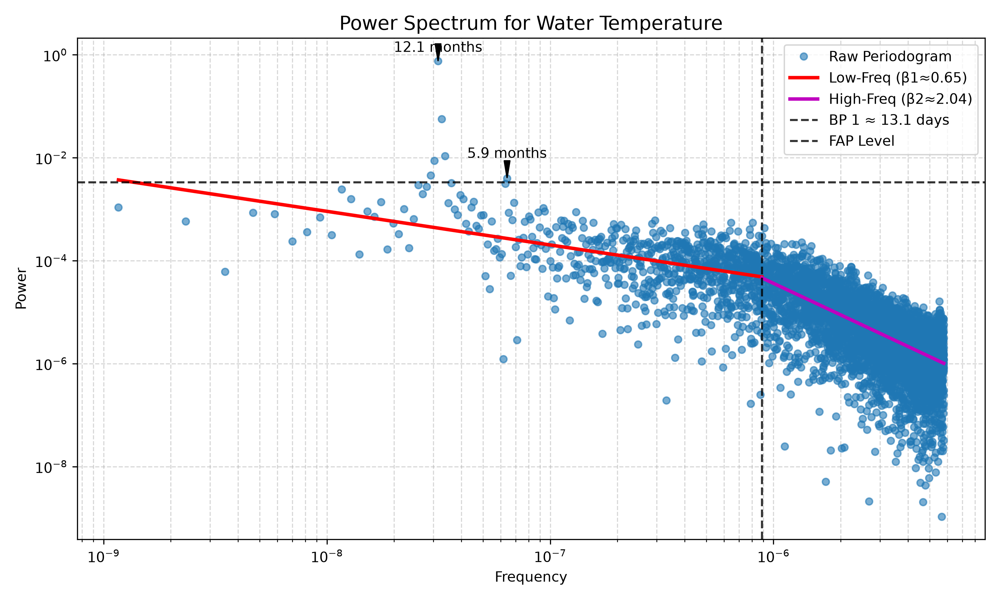

# Water Temperature Pukeokahu Analysis

This README contains the results of a spectral analysis on the Water Temperature data at Pukeokahu (Rangitikei river).

## Overview

The dataset was first preprocessed by resolving mixed date formats and removing any rows with missing or undefined dates/values. Following that, it was processed with `waterSpec` to estimate spectral slopes ($\beta$) and identify significant periodicities. Because the original data contains irregular gaps, a robust combination of Haar Wavelets (for slope estimation) and Lomb-Scargle (for peak detection) was used.

## Analysis Results and Interpretation

The analysis compared standard linear fits to segmented fits on the spectral power log-log scale. Using Bayesian Information Criterion (BIC), a regime shift model (one breakpoint) emerged as the best representation of the variance cascade across scales.

```
Model Comparison (Lower BIC is better):
  - Standard        BIC = -4907.02 (β = 1.70)
  - Segmented (1 BP) BIC = -5728.81 (β1=0.65, β2=2.04)

==> Chosen Model: Segmented 1bp
```

### Segmented Regime Fit

The segmented regression indicates a distinct shift in process dynamics taking place around roughly **13 days**:

- **Low-Frequency (Long-term) Fit (Scales > ~13.1 days):**
  - $\beta_1$ = 0.65 (95% CI: 0.55–0.75)
  - **Interpretation:** $0 < \beta < 1$ (Fractional Gaussian Noise / event-driven). This points to weakly persistent, bounded variability at seasonal and multi-week scales (medium persistence). Changes at this scale are more stationary, potentially driven by overarching seasonal forcing and weather patterns buffering the system.

- **Breakpoint:** ~13.1 days (95% CI: 11.6 days–14.7 days)
  - **Interpretation:** This crossover points to the threshold where rapid, high-persistence daily/weekly variability yields to stable seasonal event-driven shifts.

- **High-Frequency (Short-term) Fit (Scales < ~13.1 days):**
  - $\beta_2$ = 2.04 (95% CI: 1.96–2.11)
  - **Interpretation:** $\beta \approx 2$ (Brownian Noise). This indicates a strong random walk process or highly persistent behavior (storage-dominated) dominating short-term day-to-day temperature variability. Daily water temperatures strongly depend on the previous day's temperature, driven by the thermal mass and short-term heating/cooling cycles.

### Significant Periodicities Found

Significant periodic cycles were robustly identified using Lomb-Scargle spectral peak detection at a 1.0% False Alarm Probability (FAP) level:

  - **Period: 12.1 months** - Represents the annual (seasonal) solar and atmospheric temperature cycle.
  - **Period: 5.9 months** - Represents the semi-annual harmonic, capturing seasonal asymmetries or bi-annual shifts in flow/temperature dynamics.

## Generated Plots

Below are the visual outputs from the analysis:

### Haar Wavelet Fluctuation Spectrum


### Lomb-Scargle Periodogram

