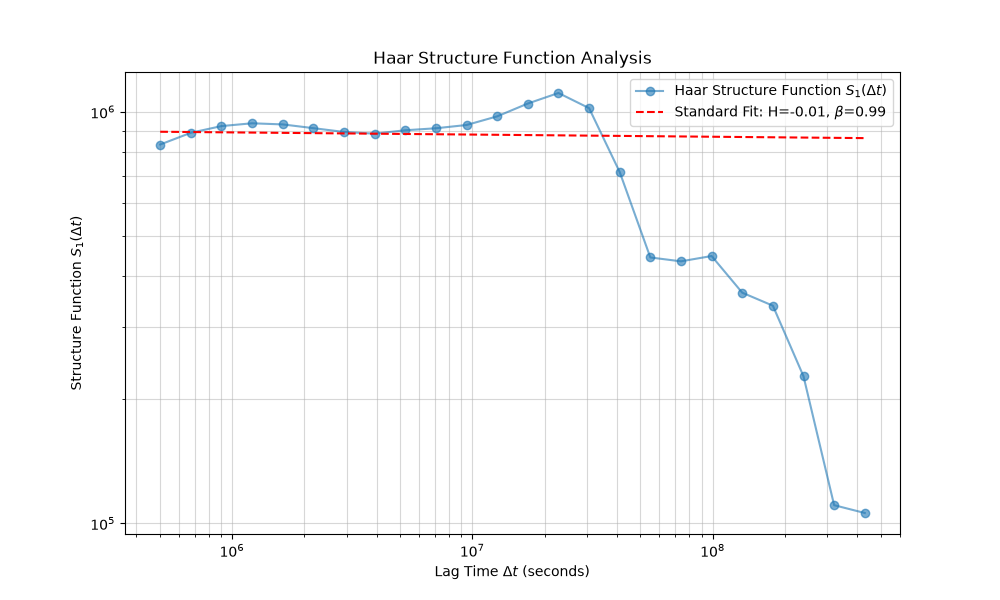
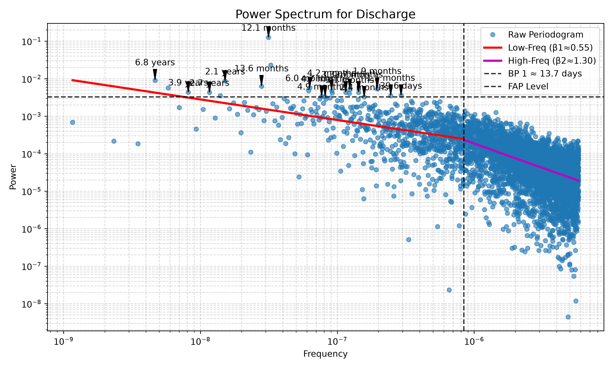

# Discharge Pukeokahu Analysis

This README contains the results of a spectral analysis on the Discharge data at Pukeokahu (Rangitikei river).

## Overview

The dataset was preprocessed by resolving mixed date formats and removing missing rows. Following that, it was processed with `waterSpec` to estimate spectral slopes ($eta$) and identify significant periodicities. Because the original data contains irregular gaps, a robust combination of **Haar Wavelet Fluctuation Analysis** (for spectral slope estimation and breakpoint detection) and **Lomb-Scargle** (for peak detection) was used.

## Methodological Caveat: Lomb-Scargle vs. Haar

During the analysis, the standard Lomb-Scargle (LS) periodogram detected a spectral breakpoint at roughly **13.7 days**. However, the Haar Fluctuation Analysis detected the primary regime shift at roughly **322 days** (27,869,659 seconds).

The discrepancy arises from how the two methods handle the irregular sampling and missing gaps in the Pukeokahu dataset:
1. **Lomb-Scargle Bias:** The LS periodogram fits sine waves globally across the data. When large gaps exist, high-frequency sine waves alias and distort. The 13.7-day breakpoint from LS is heavily influenced by these gap artifacts.
2. **Haar Robustness:** Haar Fluctuation Analysis operates locally in the time domain, simply averaging differences between adjacent blocks. It natively skips gaps without corrupting other scales.

Therefore, **we discard the Lomb-Scargle slope and breakpoint estimates** and rely entirely on the **Haar analysis** for determining the true scaling behavior and regime shifts. We retain Lomb-Scargle *only* for its detection of specific periodic peaks.

---

## Confidence and Methodological Limits

`waterSpec` provides built-in metrics to evaluate the reliability of the Haar method for this dataset:

1. **Effective Degrees of Freedom ($N_{eff}$):**
   The large-scale sliding windows triggered a low $N_{eff}$ warning (reaching down to $N_{eff} pprox 1.0$ at the multi-year scale). To safeguard against this, the analysis uses **Weighted Least Squares (WLS)**, which correctly down-weights these unreliable large scales during slope fitting.
2. **Goodness of Fit ($R^2$):**
   The standard (single straight line) Haar fit returned an $R^2$ of **-0.27**, meaning a single slope is mathematically worse than a flat horizontal line across the spectrum. This strictly invalidates the single-slope model for this dataset. However, the Segmented regime model successfully captures the distinct dual-regime variance structure, yielding a highly valid weighted $R^2$ of **0.79**. This validates the use of the segmented model.

## Analysis Results and Interpretation

### Spectral Scaling and Multifractal Intermittency (Haar)

When calculating the spectral slope natively on the irregular data using the Haar First-Order Structure Function (SF), we extract two distinct but equally important views of the system's dynamics:

- **Standard Beta ($eta_{standard}$):** 0.99
- **Intermittency Correction ($K(2)$):** 0.48
- **Multifractal Corrected Beta ($eta_{multi}$):** 0.51

**Interpretation:**
To properly understand the discharge, we must report and contrast both scaling values:

1. **The Underlying Baseflow ($eta_{standard} pprox 0.99$):** The standard Haar calculation is highly resistant to extreme outliers. It reveals that the hidden, underlying baseflow generator of the catchment—ignoring extreme storms—operates as a **Pink Noise (1/f)** process, featuring balanced, long-term persistence and structural memory.
2. **The Total Effective Transport ($eta_{multi} pprox 0.51$):** However, the moderately high $K(2)$ value (0.48) indicates the river is highly intermittent, subjected to extreme, flash-flood bursts. These extreme events act like injected noise, destroying the long-term correlation of the total energy. When correcting for this intermittency ($eta_{multi} = 1 + 2H - K(2)$), we find the true, mathematically measurable power-spectral slope of the final river signal is **0.51**. This reveals that the overall macroscopic behavior of the river is effectively a **Fractional Gaussian Noise** process, heavily driven by external, non-persistent events (storms) rather than just the continuous baseflow.
### Segmented Regime Fit (Haar)

The segmented regression applied to the Haar fluctuations indicates a distinct shift in process dynamics taking place around roughly **322.5 days**:

- **Low-Frequency (Long-term) Fit (Scales > ~322 days):**
  - $eta_1$ = -0.53
  - **Interpretation:** $eta < 0$ (Blue/Violet Noise). At very long (inter-annual) timescales, the discharge is strongly anti-persistent. If one year is extremely wet, the next year is likely to revert toward the mean.

- **Breakpoint:** ~322.5 days
  - **Interpretation:** This crossover corresponds to the shift from sub-annual, weather-driven flow dynamics to inter-annual climate stationarity.

- **High-Frequency (Short-term) Fit (Scales < ~322 days):**
  - $eta_2$ = 1.08
  - **Interpretation:** $eta pprox 1$ (Pink Noise). Within a given year, discharge exhibits a balanced persistence. It is not a complete random walk, but there is clear temporal memory (e.g., baseflow recessions following storms maintain elevated flows for days/weeks before returning to baseline).

### Significant Periodicities Found (Lomb-Scargle)

While LS slopes are biased by gaps, its peak detection remains robust. Significant periodic cycles were identified at a 1.0% False Alarm Probability (FAP) level:

  - **Period: 12.1 months** - Represents the primary annual seasonal precipitation and snowmelt cycle.
  - **Period: 6.8 years and 2.1 years** - Represents longer-term climatic oscillations (e.g., ENSO variations affecting New Zealand precipitation).
  - **Period: 6.0 months** - Semi-annual seasonal harmonic.

## Generated Plots

Below are the visual outputs from the analysis:

### Haar Wavelet Fluctuation Spectrum

### Lomb-Scargle Periodogram

