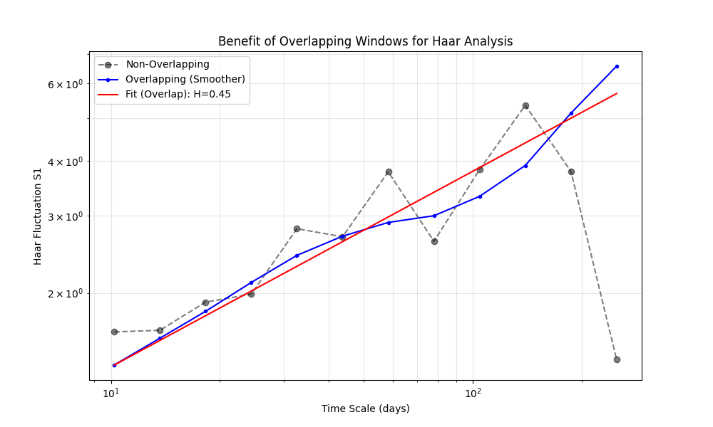
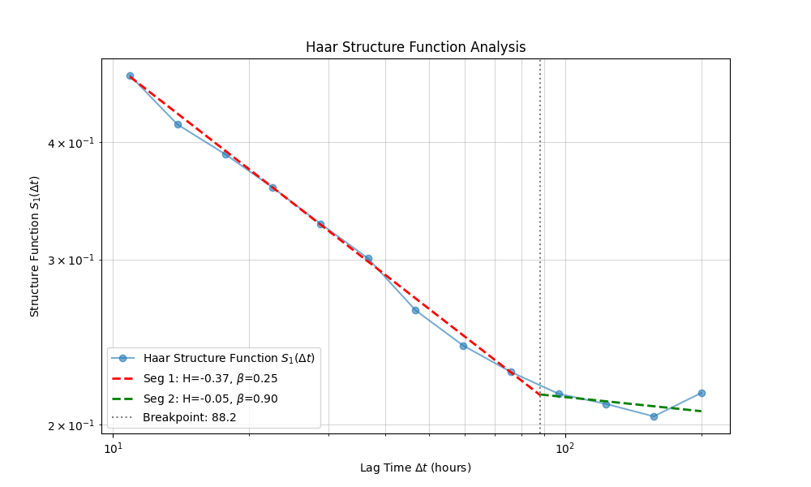
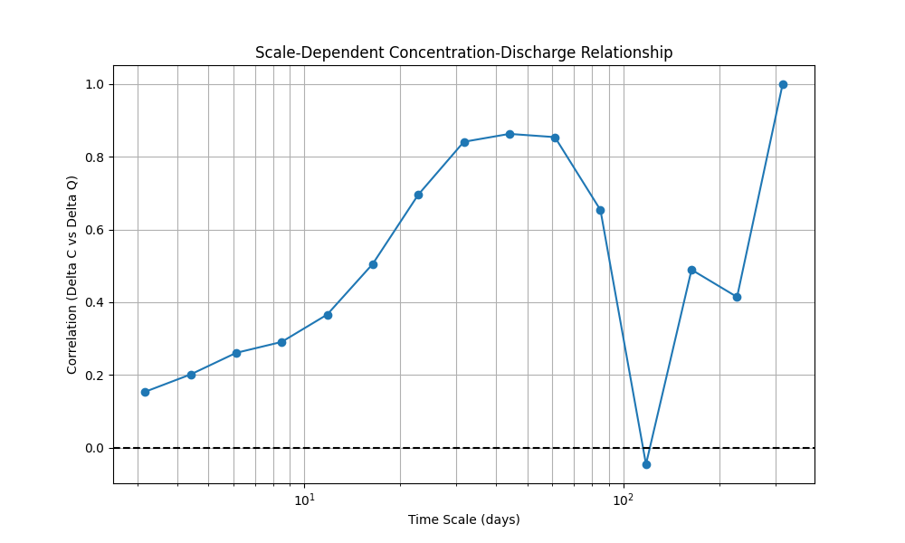
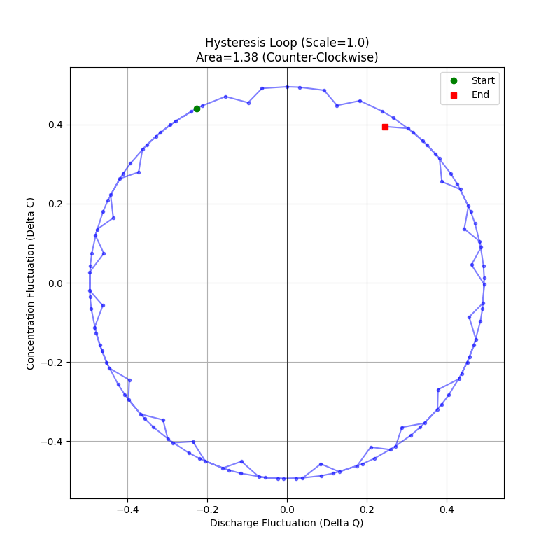
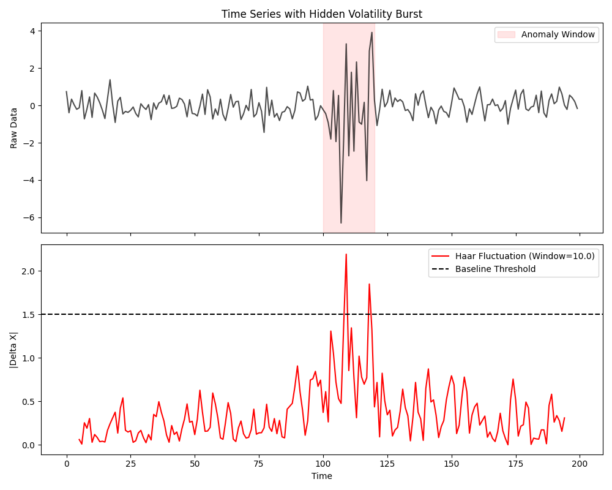
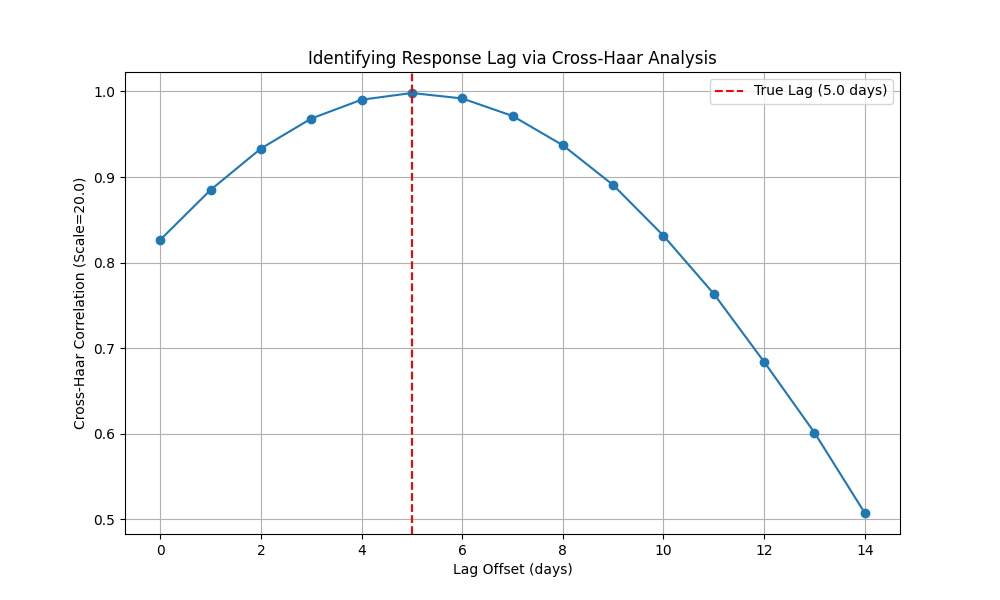

# waterSpec: Step-by-Step Walkthrough

This document provides a comprehensive guide to using the advanced features of `waterSpec`, including Haar fluctuation analysis with overlapping windows, segmented regression for regime shift detection, bivariate analysis for concentration-discharge relationships, and **Multivariate Analysis** for disentangling complex relationships.

Each section includes a self-contained Python code example that generates synthetic data, performs the analysis, and explains the results.

To run all examples at once and generate the plots shown below, use the provided script:
```bash
python3 examples/full_walkthrough.py
```
Outputs will be saved to `examples/output/`.

---

## 1. Haar Analysis with Overlapping Windows

**Scientific Context:**
Haar analysis quantifies how the variability of a time series changes with time scale ($\tau$). For short or irregular records, using non-overlapping windows can discard valuable data. Overlapping windows maximize the statistical power of the analysis.



**Example Code:**

```python
import numpy as np
from waterSpec.haar_analysis import HaarAnalysis

# 1. Generate synthetic Fractional Brownian Motion (fBm)
# This represents a non-stationary "random walk" process (e.g., cumulative load).
np.random.seed(42)
n_points = 500
time = np.arange(n_points)
# Random walk: cumulative sum of white noise
data = np.cumsum(np.random.randn(n_points))

# 2. Initialize Haar Analysis
haar = HaarAnalysis(time, data, time_unit="days")

# 3. Run analysis with Overlapping Windows
# overlap=True enables sliding windows.
# overlap_step_fraction=0.1 means the window slides by 10% of its duration at each step.
results = haar.run(
    min_lag=2,
    max_lag=100,
    num_lags=20,
    overlap=True,
    overlap_step_fraction=0.1,
    n_bootstraps=200
)

# 4. Interpret Results
beta = results['beta']
H = results['H']
n_eff = results['n_effective'][-1]  # Effective N at largest scale

print(f"Estimated Spectral Slope (beta): {beta:.2f}")
print(f"Hurst Exponent (H): {H:.2f}")
print(f"Effective Sample Size at largest scale: {n_eff:.1f}")

# Expected Output:
# Beta should be close to 2.0 (Brown noise/Random Walk).
# H should be close to 0.5.
```

**Interpretation of Results:**
*   **Beta $\approx$ 2.0 (Brown Noise):** This indicates a non-stationary, "random walk" process. In hydrology, this often corresponds to cumulative storage processes (e.g., large aquifers or reservoirs) where current values are the sum of past inputs. The system has infinite memory of past events.
*   **Contrast with Beta $\approx$ 0.0 (White Noise):** If you saw $\beta \approx 0$, it would imply a "memoryless" system dominated by rapid, uncorrelated events (e.g., flash floods in small impervious catchments).
*   **Overlapping Benefit:** The plot shows that overlapping windows produce a much smoother scaling curve with tighter confidence intervals, especially at large scales where data is scarce. This gives you higher confidence in the estimated slope.

---

## 2. Detecting Regime Shifts (Segmented Haar Fits)

**Scientific Context:**
Hydrological systems often exhibit different memory behaviors at different scales. For example, a system might be dominated by rapid surface runoff (low memory, white noise) at short scales (< 1 week) but by groundwater storage (high memory, brown noise) at long scales (> 1 month).



**Example Code:**

```python
import numpy as np
from waterSpec.haar_analysis import HaarAnalysis

# 1. Generate a "Regime Shift" signal
time = np.arange(1000)
# Short scales (high frequency): White Noise
noise = np.random.randn(1000)
# Long scales (low frequency): Strong Trend / Walk
trend = 0.05 * np.cumsum(np.random.randn(1000))
data = noise + trend

haar = HaarAnalysis(time, data, time_unit="hours")

# 2. Run Segmented Analysis
# max_breakpoints=1 tells the system to look for one regime shift.
results = haar.run(
    min_lag=2,
    max_lag=200,
    overlap=True,
    max_breakpoints=1
)

seg = results['segmented_results']

print(f"Number of Breakpoints Found: {seg['n_breakpoints']}")
print(f"Breakpoint Scale: {seg['breakpoints'][0]:.1f} hours")
print(f"Slope (H) before breakpoint: {seg['Hs'][0]:.2f}")
print(f"Slope (H) after breakpoint: {seg['Hs'][1]:.2f}")

# Expected Output:
# Breakpoint should be detected around the scale where the trend variance overtakes the noise variance.
# H1 should be close to -0.5 (White Noise, beta=0).
# H2 should be close to +0.5 (Random Walk, beta=2).
```

**Interpretation of Results:**
*   **The Breakpoint:** The detected scale (e.g., ~40 hours in this synthetic example) represents the "characteristic time" of the system. In a real catchment, this could correspond to the transition from storm-event scale to seasonal scale.
*   **Slope Change:**
    *   **Small Scales ($H \approx -0.5, \beta \approx 0$):** The system behaves like white noise. It forgets perturbations quickly. Management actions here (e.g., stopping a point source) would have immediate effects.
    *   **Large Scales ($H \approx 0.5, \beta \approx 2$):** The system behaves like a random walk. It "remembers" and integrates inputs. Management actions will take a long time to manifest as a trend change against the background wandering.

---

## 3. Bivariate Analysis (Concentration-Discharge)

**Scientific Context:**
Analyzing how water quality ($C$) relates to flow ($Q$) is fundamental. The relationship is rarely static; it varies by event and scale. This tool aligns mis-matched timestamps and computes the correlation of *fluctuations* ($\Delta C$ vs $\Delta Q$).



**Example Code:**

```python
import numpy as np
import pandas as pd
from waterSpec.bivariate import BivariateAnalysis

# 1. Generate Synthetic C-Q Data
# Q: Daily discharge
time_q = np.arange(0, 365, 1.0) # Daily
Q = np.exp(np.sin(time_q/10) + np.random.normal(0, 0.2, len(time_q))) # Log-normalish

# C: Bi-weekly concentration sampling (sparse)
# Let's say C is positively correlated with Q (flushing)
time_c = np.arange(0, 365, 14.0) # Every 14 days
C = 0.5 * np.interp(time_c, time_q, Q) + np.random.normal(0, 0.1, len(time_c))

# 2. Initialize Bivariate Analysis
# We treat Q as the driver (Var 2) and C as the response (Var 1)
biv = BivariateAnalysis(time_c, C, "Nitrate", time_q, Q, "Discharge", time_unit="days")

# 3. Align Data
# Since C is sparse, we match Q to C's timestamps.
biv.align_data(tolerance=1.0, method='nearest')

# 4. Cross-Haar Correlation
# Calculate correlation at a monthly scale (30 days)
cross_results = biv.run_cross_haar_analysis(
    lags=np.array([7, 14, 30, 60]),
    overlap=True
)

print("Scale (days) | Correlation (rho)")
for lag, rho in zip(cross_results['lags'], cross_results['correlation']):
    print(f"{lag:12.1f} | {rho:.2f}")

# Expected Output:
# High positive correlation at scales > 14 days (reflecting the constructed flushing relationship).
```

**Interpretation of Results:**
*   **Positive Correlation ($\rho > 0$):** Indicates "Flushing" or "Mobilization". High flows mobilize more constituent (e.g., sediment, particulate P).
*   **Negative Correlation ($\rho < 0$):** Indicates "Dilution". High flows dilute a constant source (e.g., point source inputs, weathering-derived ions).
*   **Scale Dependence:** If $\rho$ is near 0 at short scales but high at long scales, it suggests that individual storms don't drive concentration changes, but seasonal wet/dry cycles do. This implies distinct transport pathways are active at different frequencies.

---

## 4. Hysteresis Analysis (Loop Area)

**Scientific Context:**
Hysteresis occurs when the path of concentration vs. discharge differs on the rising vs. falling limb of a hydrograph. The "Loop Area" metric quantifies this directionality at a specific time scale $\tau$.
*   **Positive Area:** Counter-Clockwise (Groundwater dominance / slow response).
*   **Negative Area:** Clockwise (Source exhaustion / rapid flushing).



**Example Code:**

```python
# Continuing from previous Bivariate setup...

# Let's simulate a hysteresis effect (phase shift)
# Q = cos(t), C = sin(t) -> Counter-Clockwise circle
time = np.linspace(0, 100, 200)
Q_hyst = np.cos(time/5)
C_hyst = np.sin(time/5)

biv_hyst = BivariateAnalysis(time, C_hyst, "C", time, Q_hyst, "Q")
biv_hyst.align_data(tolerance=0.1)

# Analyze at the scale of the "event" (approx period 10 * pi ~ 30)
hyst_stats = biv_hyst.calculate_hysteresis_metrics(tau=10.0)

print(f"Hysteresis Direction: {hyst_stats['direction']}")
print(f"Loop Area: {hyst_stats['area']:.4f}")

# Expected Output:
# Direction: Counter-Clockwise
# Area: Positive
```

**Interpretation of Results:**
*   **Clockwise (Negative Area):** Concentration peaks *before* discharge. This suggests a "first flush" effect where available pollutants on the surface are washed off quickly and exhausted before the peak flow arrives.
*   **Counter-Clockwise (Positive Area):** Concentration peaks *after* discharge. This suggests a delayed source, such as distant groundwater inputs or slow subsurface mixing, which arrives later in the event.
*   **Zero Area:** Linear response (no hysteresis). The system responds instantaneously.

---

## 5. Real-Time Anomaly Detection (Sliding Haar)

**Scientific Context:**
Traditional anomaly detection uses thresholds on raw values. However, baselines shift. "Sliding Haar" looks at the *volatility* (magnitude of change) over a fixed window. A sudden spike in the Haar fluctuation indicates a regime change or event, even if the absolute value is within bounds.



**Example Code:**

```python
from waterSpec.haar_analysis import calculate_sliding_haar
import matplotlib.pyplot as plt

# 1. Generate data with a "Hidden" Anomaly
# Base: Quiet noise
data = np.random.normal(0, 0.5, 200)
# Event: At t=100, variability increases 5x, but mean stays same
data[100:120] = np.random.normal(0, 2.5, 20)
time = np.arange(200)

# 2. Compute Sliding Haar
# Window size = 10 units
t_centers, fluctuations = calculate_sliding_haar(
    time, data, window_size=10.0, step_size=1.0
)

# 3. Detect Peaks (Simple Threshold)
# Ideally, compare to historical 3-sigma
threshold = 3 * np.std(fluctuations[:50]) # calibrate on early data
anomalies = t_centers[np.abs(fluctuations) > threshold]

print(f"Anomalous Time Windows Detected: {len(anomalies)}")
if len(anomalies) > 0:
    print(f"First Anomaly at t ~ {anomalies[0]:.1f}")

# Expected Output:
# Should detect the volatility burst around t=100.
```

**Interpretation of Results:**
*   **Why Volatility Matters:** In the example, the mean of the data didn't change, so a standard "mean shift" detector might miss it. However, the *variability* exploded. This often precedes system failures (e.g., sensor drift start) or indicates a new pollution source type (e.g., intermittent dumping).
*   **Action:** When the sliding Haar metric exceeds a threshold (e.g., $3\sigma$), it triggers an alarm for operators to investigate, even if the concentration levels are technically "legal".

---

## 6. Lagged Response Analysis

**Scientific Context:**
Often, a system's response to a driver is not instantaneous. Lagged Cross-Haar correlation ($\rho_{CQ}(\tau, \ell)$) helps identify the characteristic delay time ($\ell$) between discharge ($Q$) and concentration response ($C$) at a specific time scale $\tau$.



**Example Code:**

```python
import numpy as np
from waterSpec.bivariate import BivariateAnalysis

# 1. Generate Data with Known Lag
time = np.arange(0, 365, 1.0)
Q = np.exp(np.sin(time/10))
lag_true = 5.0 # Response lags driver by 5 days
C = np.exp(np.sin((time - lag_true)/10)) + np.random.normal(0, 0.1, len(time))

biv = BivariateAnalysis(time, C, "Response", time, Q, "Driver")
biv.align_data(tolerance=0.1)

# 2. Run Lagged Analysis at a fixed scale
tau = 20.0
offsets = np.arange(0, 15, 1.0) # Check lags 0 to 15 days

res = biv.run_lagged_cross_haar(tau, offsets, overlap=True)

# 3. Identify Peak Lag
peak_idx = np.argmax(res['correlation'])
peak_lag = res['lag_offsets'][peak_idx]

print(f"True Lag: {lag_true} days")
print(f"Estimated Lag: {peak_lag} days")

# Expected Output:
# Estimated Lag should be 5.0 days.
```

**Interpretation of Results:**
*   **Peak Location:** The lag offset where correlation is maximized represents the *dominant travel time* or reaction time of the catchment.
*   **Physical Meaning:**
    *   **Short Lag (~0 days):** Surface runoff dominance. Pollutants are washed off immediately.
    *   **Long Lag (Days to Weeks):** Subsurface flow. Rain infiltrates, pushes old water out (piston flow), and solutes arrive much later.
    *   **Application:** If you install a Best Management Practice (BMP) like a buffer strip, you might expect the lag time to increase as the flow path becomes longer/slower.

---

## 7. Multivariate Analysis (Partial Cross-Haar)

**Scientific Context:**
Correlation does not imply causation. A correlation between Concentration ($C$) and Discharge ($Q$) might be spurious if both are driven by Precipitation ($P$). **Partial Cross-Haar Correlation** ($\rho_{CQ \cdot P}$) quantifies the relationship between $C$ and $Q$ while mathematically removing the linear effect of $P$. This is critical for legal attribution of pollution sources.

**Example Code:**

```python
import numpy as np
from waterSpec.multivariate import MultivariateAnalysis

# 1. Generate Chain Data: P -> Q -> C
# P drives Q, Q drives C.
# C is correlated with P, but only indirectly through Q.
n = 2000
time = np.arange(n)
P = np.random.randn(n)                   # Precipitation (Random)
Q = 0.7 * P + 0.3 * np.random.randn(n)   # Discharge (Driven by P)
C = 0.8 * Q + 0.2 * np.random.randn(n)   # Concentration (Driven by Q)

inputs = [
    {'time': time, 'data': C, 'name': 'Conc'},
    {'time': time, 'data': Q, 'name': 'Discharge'},
    {'time': time, 'data': P, 'name': 'Precip'}
]

# 2. Initialize Multivariate Analysis
multi = MultivariateAnalysis(inputs)
multi.align_data(tolerance=0.1)

lags = np.array([10, 20, 50])

# 3. Test Direct Relationship: C vs Q (controlling for P)
# Should remain high because Q directly drives C.
res_direct = multi.run_partial_cross_haar_analysis(
    target_var1='Conc',
    target_var2='Discharge',
    conditioning_vars=['Precip'],
    lags=lags
)

# 4. Test Indirect Relationship: C vs P (controlling for Q)
# Should drop to near zero because P only affects C via Q.
res_indirect = multi.run_partial_cross_haar_analysis(
    target_var1='Conc',
    target_var2='Precip',
    conditioning_vars=['Discharge'],
    lags=lags
)

print("Scale | Partial Corr (C-Q | P) | Partial Corr (C-P | Q)")
for i, lag in enumerate(lags):
    pc_cq = res_direct['partial_correlation'][i]
    pc_cp = res_indirect['partial_correlation'][i]
    print(f"{lag:5.0f} | {pc_cq:18.2f} | {pc_cp:18.2f}")

# Expected Output:
# C-Q | P should be significant (> 0.5).
# C-P | Q should be negligible (~ 0.0), proving P is not the direct driver.
```

**Interpretation of Results:**
*   **High Partial Correlation:** Indicates a direct functional link. In the example, $C$ responds to flow mechanics ($Q$) regardless of where the water came from.
*   **Low Partial Correlation:** Indicates the relationship was spurious or fully mediated by the conditioning variable. If controlling for $Q$ makes the $C$-$P$ correlation vanish, it proves that rain only affects concentration by generating flow, not by some other mechanism (e.g., atmospheric deposition).

---

## 8. Event-Based Segmentation (Regime Analysis)

**Scientific Context:**
A single spectral slope often fails to capture the complexity of a system that switches between "storm events" (high energy) and "baseflow" (low energy). **Event-Based Segmentation** uses the sliding Haar fluctuation metric to automatically detect these regimes and analyze them separately.

**Example Code:**

```python
import numpy as np
from waterSpec import Analysis
from waterSpec.segmentation import RegimeAnalysis

# 1. Generate Data with Bursts
# Baseflow: White noise (beta ~ 0)
n = 2000
time = np.arange(n)
data = np.random.normal(0, 0.5, n)
# Events: Bursts of Brown noise (beta ~ 2) added at intervals
for i in range(0, n, 400):
    data[i:i+100] += np.cumsum(np.random.normal(0, 0.5, 100))

# 2. Initialize Analysis
ana = Analysis(time_array=time, data_array=data, time_col="t", data_col="y")

# 3. Segment by Fluctuation
# Detect events based on volatility exceeding 2x the Median Absolute Deviation (MAD)
regime = RegimeAnalysis(ana)
slices = regime.segment_by_fluctuation(scale=10, threshold_factor=2.0)

print(f"Detected {len(slices['event'])} event segments.")

# 4. Compare Spectral Slopes
# Analyze the concatenated 'event' data vs 'baseflow' data
results = regime.run_regime_comparison(min_lag=1, max_lag=50)

beta_event = results['event']['beta']
beta_base = results['baseflow']['beta']

print(f"Baseflow Beta: {beta_base:.2f}")
print(f"Event Beta:    {beta_event:.2f}")

# Expected Output:
# Baseflow Beta ~ 0.0 (uncorrelated noise)
# Event Beta ~ 2.0 (strong memory/trend)
```

**Interpretation of Results:**
*   **Regime Separation:** This method objectively separates the dataset without manual selection.
*   **Distinct Slopes:** Finding a high $\beta$ during events implies that during storms, the system is transport-limited or integrates previous conditions (hysteresis). A low $\beta$ during baseflow implies the system is essentially random or chemostatic during quiet periods.
*   **Application:** This allows you to report "The river behaves as a chemostat during baseflow but exhibits strong source-limitation during storms," which is a much more nuanced and legally defensible statement than a single average slope.
