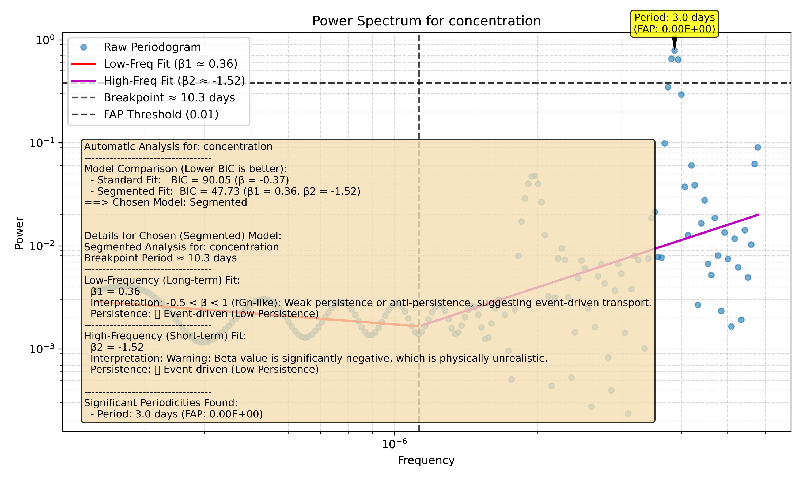

# Tutorial 1: Quickstart Guide

This quickstart guide will show you the fastest and recommended way to use the `waterSpec` package. We'll take a sample data file and, with just a few lines of code, run a full spectral analysis to get our results, a plot, and a text summary.

### Step 1: Import The `Analysis` Class

First, we need to import the main `Analysis` class from our package.

```python
from waterSpec import Analysis
```

### Step 2: Create an `Analysis` Object

The new workflow is centered around an `Analysis` object. You create it by pointing to your data file and specifying the time and data columns. This one step handles loading and preprocessing the data.

```python
analyzer = Analysis(
    file_path='examples/sample_data.csv',
    time_col='timestamp',
    data_col='concentration',
    param_name='Sample Concentration' # A descriptive name for plots
)
```

### Step 3: Run the Full Analysis

Now for the main event. We'll call the `run_full_analysis()` method and tell it where to save the outputs. This single command runs the entire best-practice workflow.

```python
results = analyzer.run_full_analysis(
    output_dir='docs/tutorials/quickstart_outputs',
    seed=42 # Use a seed for reproducible results
)

# The method returns a dictionary with all the numerical results.
# Let's look at the main interpretation text.
print(results['summary_text'])
```

### The Final Result

That's it! After running the code, a new directory `docs/tutorials/quickstart_outputs` will be created with your results. It will contain:

1.  **A PNG plot** of the power spectrum, the fitted line, and an interpretive summary.
2.  **A TXT file** with a detailed text summary of the analysis.

Here is the plot generated by this example:



And here is the content of the summary file:

```text
Automatic Analysis for: concentration
-----------------------------------
Model Comparison (Lower BIC is better):
  - Standard Fit:   BIC = 90.05 (β = -0.37)
  - Segmented Fit:  BIC = 47.73 (β1 = 0.36, β2 = -1.52)
==> Chosen Model: Segmented
-----------------------------------

Details for Chosen (Segmented) Model:
Segmented Analysis for: concentration
Breakpoint Period ≈ 10.3 days
-----------------------------------
Low-Frequency (Long-term) Fit:
  β1 = 0.36
  Interpretation: -0.5 < β < 1 (fGn-like): Weak persistence or anti-persistence, suggesting event-driven transport.
  Persistence: 🔴 Event-driven (Low Persistence)
-----------------------------------
High-Frequency (Short-term) Fit:
  β2 = -1.52
  Interpretation: Warning: Beta value is significantly negative, which is physically unrealistic.
  Persistence: 🔴 Event-driven (Low Persistence)

-----------------------------------
Significant Periodicities Found:
  - Period: 3.0 days (FAP: 0.00E+00)
```

This new class-based workflow simplifies the process, making it easier and more efficient to get the results you need. In the next tutorials, we'll dive deeper into all the options and features this package has to offer.
