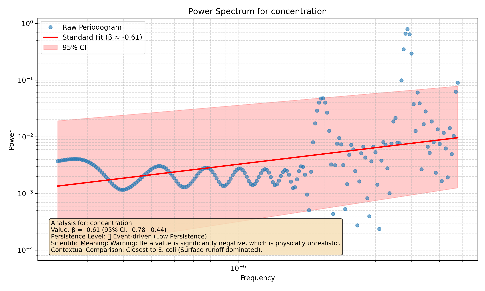

# Tutorial 1: Quickstart Guide

This quickstart guide will show you the fastest way to use the `waterSpec` package. We'll take a sample data file and, with a single command, run a full spectral analysis to get our results and a plot.

### Step 1: Import The `run_analysis` function

First, we need to import the main function from our package.

```python
from waterSpec import run_analysis
```

### Step 2: Set the Path to the Data

Our package comes with some sample data. We'll point to the `sample_data.csv` file located in the `examples/` directory.

```python
file_path = 'examples/sample_data.csv'
```

### Step 3: Run the Analysis

Now for the main event. We'll call `run_analysis` and tell it which columns in our file contain the timestamps and the data we want to analyze. The function will return a dictionary full of our results.

```python
results = run_analysis(
    file_path=file_path,
    time_col='timestamp',
    data_col='concentration'
)

# Let's look at the interpretation text
print(results['summary_text'])
```

**Output:**

```text
Analysis for: concentration
Value: β = -0.61 (95% CI: -0.79–-0.46)
Persistence Level: 🔴 Event-driven (Low Persistence)
Scientific Meaning: Warning: Beta value is significantly negative, which is physically unrealistic.
Contextual Comparison: Closest to E. coli (Surface runoff-dominated).
```

### Step 4: Generate a Plot

Words and numbers are fine, but a plot is often better! Let's run the analysis again, but this time we'll tell it to create and save a plot for us. We just need to set `do_plot=True` and provide an `output_path`.

```python
plot_path = 'docs/tutorials/01_quickstart_plot.png'

run_analysis(
    file_path=file_path,
    time_col='timestamp',
    data_col='concentration',
    do_plot=True,
    output_path=plot_path
)

print(f"Plot saved to: {plot_path}")
```

### The Final Result

That's it! You've run your first analysis. You have a dictionary of results and a plot saved to your directory. Here's what that plot looks like:



This chart shows the power spectrum of your data, the fitted line used to calculate the spectral exponent (β), and a handy summary of the interpretation right on the plot.

Congratulations! In the next tutorials, we'll dive deeper into all the options and features this package has to offer.
