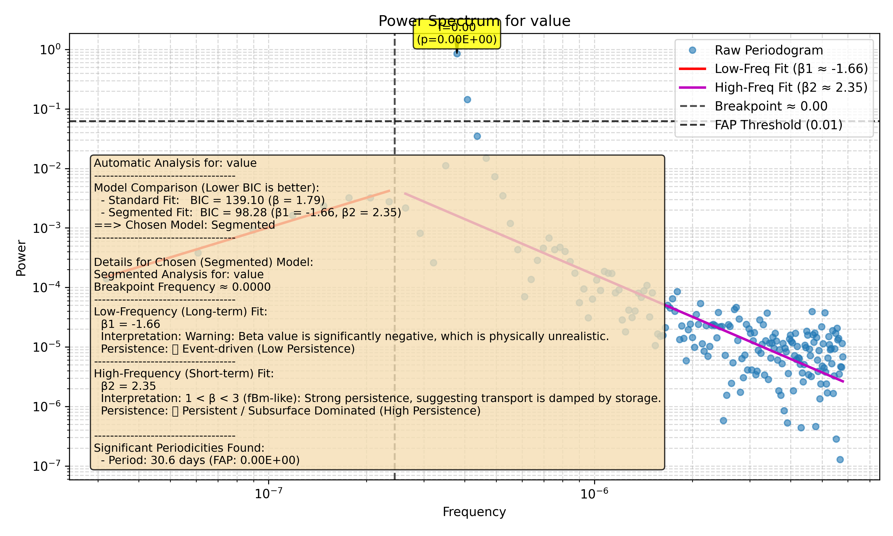

# Tutorial 6: Finding Significant Peaks with FAP

When you look at a power spectrum, you'll see many peaks. But which ones are real signals and which are just random noise? To answer this, we use a statistical tool called the False Alarm Probability (FAP).

The FAP tells you the probability that a peak of a given power could have occurred by chance alone. A low FAP gives you high confidence that you've found a real periodic signal. This tutorial shows you how to use the FAP feature in `waterSpec`.

### Step 1: Create a Signal with a Known Periodicity

To test the peak-finding feature, let's create a synthetic dataset that we know has a periodic signal. We'll create a sine wave with a period of 30 days and add a small amount of random noise.

```python
import numpy as np
import pandas as pd

# Create a synthetic time series
n_points = 365
time = pd.to_datetime(np.arange(n_points), unit='D', origin='2022-01-01')
period = 30 # days
frequency_cpd = 1.0 / period # cycles per day
rng = np.random.default_rng(42)
series = 5 * np.sin(2 * np.pi * frequency_cpd * np.arange(n_points)) + rng.normal(0, 0.1, n_points)

# Save it to a temporary file
file_path = 'examples/periodic_data.csv'
df = pd.DataFrame({'timestamp': time, 'value': series})
df.to_csv(file_path, index=False)
```

### Step 2: Manually Run Peak Detection

While `run_analysis` can find peaks, for a focused search it's often better to use the lower-level `find_significant_peaks` function. This also lets us choose the best type of frequency grid for the job.

**Pro-Tip:** For finding specific peaks, a **linear** frequency grid is often better than the log-spaced grid used for fitting beta. Let's create one.

```python
from waterSpec import load_data
from waterSpec.spectral_analyzer import calculate_periodogram, find_significant_peaks
from astropy.timeseries import LombScargle

# Load the data
time_numeric, data_series, _ = load_data(file_path, 'timestamp', 'value')

# Generate a LINEAR frequency grid
duration = np.max(time_numeric) - np.min(time_numeric)
min_freq_hz = 1 / duration
nyquist_freq_hz = 0.5 / np.median(np.diff(time_numeric))
linear_frequency_grid = np.linspace(min_freq_hz, nyquist_freq_hz, 5000)

# Calculate the periodogram to get the power and the LombScargle object
_, power, ls_obj = calculate_periodogram(
    time_numeric,
    data_series.to_numpy(),
    frequency=linear_frequency_grid
)

# Find significant peaks
peaks, fap_level = find_significant_peaks(
    ls_obj,
    linear_frequency_grid,
    power,
    fap_threshold=0.01,
    fap_method='baluev' # Use a fast method for the tutorial
)

print("Found significant peaks:")
for peak in peaks:
    freq_cpd = peak['frequency'] * 86400 # Convert from Hz to cycles/day
    print(f"  - Frequency: {freq_cpd:.4f} cycles/day, Power: {peak['power']:.2f}, FAP: {peak['fap']:.2E}")
```

**Output:**
```text
--- Manual Peak Detection ---
Found significant peaks:
  - Frequency: 0.0333 cycles/day, Power: 1.00, FAP: 0.00E+00
```

Success! The analysis found a peak right at our known frequency of `1/30 = 0.0333` cycles/day.

### Step 3: Visualize the FAP

Now, let's use the main `run_analysis` function just to generate the plot, which will automatically include the FAP threshold and annotate the significant peaks.

```python
from waterSpec import run_analysis

plot_path = 'docs/tutorials/06_fap_plot.png'

run_analysis(
    file_path=file_path,
    time_col='timestamp',
    data_col='value',
    detrend_method=None, # Important: Don't detrend away the signal we want to find!
    fap_threshold=0.01,
    do_plot=True,
    output_path=plot_path,
    grid_type='linear' # Use linear grid for better peak resolution
)

print(f"Plot with FAP annotations saved to: {plot_path}")
```

Here is the resulting plot:



The dashed line shows the 1% FAP threshold. Any peak rising above this line is considered statistically significant, and our 30-day signal clearly does!
