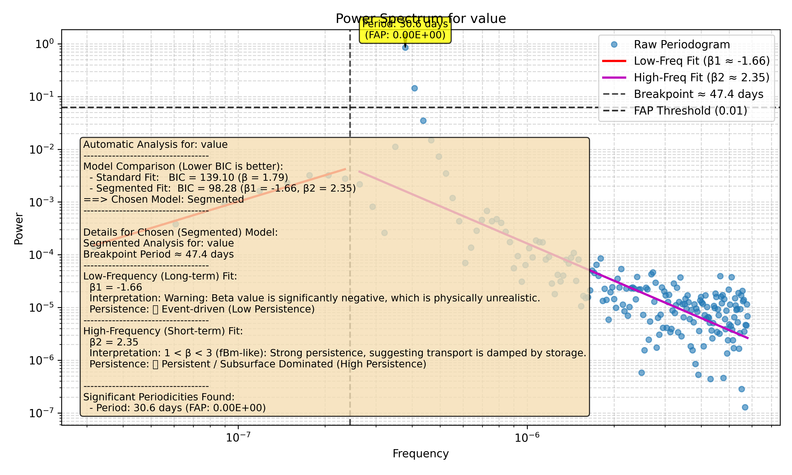

# Tutorial 6: Finding Significant Peaks with FAP

When you look at a power spectrum, you'll see many peaks. But which ones are real signals and which are just random noise? To answer this, we use a statistical tool called the False Alarm Probability (FAP).

The FAP tells you the probability that a peak of a given power could have occurred by chance alone. A low FAP gives you high confidence that you've found a real periodic signal. This tutorial shows you how to use the FAP feature in `waterSpec`.

### Step 1: Create a Signal with a Known Periodicity

To test the peak-finding feature, let's create a synthetic dataset that we know has a periodic signal. We'll create a sine wave with a period of 30 days and add a small amount of random noise.

```python
import numpy as np
import pandas as pd

# Create a synthetic time series
n_points = 365
time = pd.to_datetime(np.arange(n_points), unit='D', origin='2022-01-01')
period = 30 # days
frequency_cpd = 1.0 / period # cycles per day
rng = np.random.default_rng(42)
series = 5 * np.sin(2 * np.pi * frequency_cpd * np.arange(n_points)) + rng.normal(0, 0.1, n_points)

# Save it to a temporary file
file_path = 'examples/periodic_data.csv'
df = pd.DataFrame({'timestamp': time, 'value': series})
df.to_csv(file_path, index=False)
```

### Step 2: Run the Analysis with FAP Detection

With the new `Analysis` class, finding significant peaks is incredibly simple. You just pass the `fap_threshold` argument to the `run_full_analysis` method. A common threshold is `0.01` (a 1% chance of a false alarm).

**Pro-Tip:** For finding specific peaks, a **linear** frequency grid is often better than the default log-spaced grid. We can specify this with the `grid_type` argument.

```python
from waterSpec import Analysis

# Initialize the analyzer
analyzer = Analysis(
    file_path='examples/periodic_data.csv',
    time_col='timestamp',
    data_col='value',
    detrend_method=None # Important: Don't detrend away the signal!
)

# Run the analysis with FAP detection
results = analyzer.run_full_analysis(
    output_dir='docs/tutorials/fap_outputs',
    fap_threshold=0.01,
    grid_type='linear' # Use linear grid for better peak resolution
)
```

### Step 3: Review the Outputs

The `run_full_analysis` command automatically generates a plot and a text summary with the FAP results included.

Here is the plot. The dashed red line shows the 1% FAP threshold. Any peak rising above this line is considered statistically significant, and our 30-day signal clearly does!



The text summary also lists the significant peaks that were found:

```text
Automatic Analysis for: value
-----------------------------------
Model Comparison (Lower BIC is better):
  - Standard Fit:   BIC = 139.10 (β = 1.79)
  - Segmented Fit:  BIC = 98.28 (β1 = -1.66, β2 = 2.35)
==> Chosen Model: Segmented
-----------------------------------

Details for Chosen (Segmented) Model:
Segmented Analysis for: value
Breakpoint Period ≈ 47.4 days
-----------------------------------
Low-Frequency (Long-term) Fit:
  β1 = -1.66
  Interpretation: Warning: Beta value is significantly negative, which is physically unrealistic.
  Persistence: 🔴 Event-driven (Low Persistence)
-----------------------------------
High-Frequency (Short-term) Fit:
  β2 = 2.35
  Interpretation: 1 < β < 3 (fBm-like): Strong persistence, suggesting transport is damped by storage.
  Persistence: 🟢 Persistent / Subsurface Dominated (High Persistence)

-----------------------------------
Significant Periodicities Found:
  - Period: 30.6 days (FAP: 0.00E+00)
```

By setting one simple parameter, you've performed a statistically robust search for periodic signals in your data.
