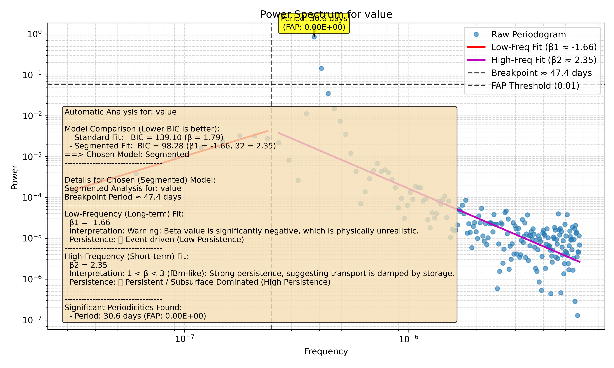

# Tutorial 7: Plotting and Visualization

A good analysis isn't complete until you have a good plot to show for it. `waterSpec`'s plotting is designed to be an all-in-one visualization that tells the full story of your analysis.

### Part 1: Automatic Plot Generation

With the new class-based workflow, plotting is easier than ever. The `run_full_analysis()` method automatically generates and saves a comprehensive plot for you.

Let's use the periodic signal we created in the last tutorial to generate a plot that has all the possible visual elements.

```python
from waterSpec import Analysis

# We use the 'periodic_data.csv' file created in the previous tutorial.
file_path = 'examples/periodic_data.csv'
output_dir = 'docs/tutorials/plotting_outputs'

# Initialize and run the analysis
analyzer = Analysis(
    file_path=file_path,
    time_col='timestamp',
    data_col='value',
    detrend_method=None
)
analyzer.run_full_analysis(
    output_dir=output_dir,
    fap_threshold=0.01,
    grid_type='linear'
)

print(f"Plot automatically saved to '{output_dir}'")
```

### Part 2: Anatomy of a `waterSpec` Plot

The plot you just created contains a wealth of information. Let's break it down piece by piece.



1.  **The Raw Periodogram (Blue Circles)**: The fundamental data points of the plot, showing spectral power at each frequency.
2.  **The Spectral Fit (Red Line)**: The line fitted to the periodogram on a log-log scale, used to calculate β.
3.  **The Confidence Interval (Shaded Red Area)**: The 95% confidence interval for the spectral fit. A wider band means more uncertainty.
4.  **The FAP Threshold (Dashed Black Line)**: The statistical significance threshold. Peaks above this line are significant.
5.  **Significant Peaks (Yellow Annotated Boxes)**: Peaks found to be above the FAP threshold, annotated with their frequency (`f`) and individual False Alarm Probability (`p`).
6.  **The Summary Box (Bottom-Left)**: The full, human-readable interpretation of the analysis.

### Part 3: Advanced (Manual) Plotting

What if you want to regenerate a plot with different colors, or save it in a different format? You can use the low-level `plot_spectrum` function directly. It takes the `frequency`, `power`, and `results` dictionary from your `Analysis` object as input.

```python
from waterSpec.plotting import plot_spectrum
import os

# Let's use the analyzer object from before
# analyzer.run_full_analysis(...) has already been run

# Define a new path for our custom plot
custom_plot_path = os.path.join(analyzer.results['output_dir'], 'custom_plot.svg')

# Manually call the plotting function
plot_spectrum(
    frequency=analyzer.frequency,
    power=analyzer.power,
    fit_results=analyzer.results,
    analysis_type=analyzer.results['chosen_model'],
    output_path=custom_plot_path,
    param_name=analyzer.param_name
)

print(f"Custom plot saved to: {custom_plot_path}")
```
This gives you full control over the final visualization.

### The End of the Map

You are now ready to explore your own time series data with `waterSpec`!
