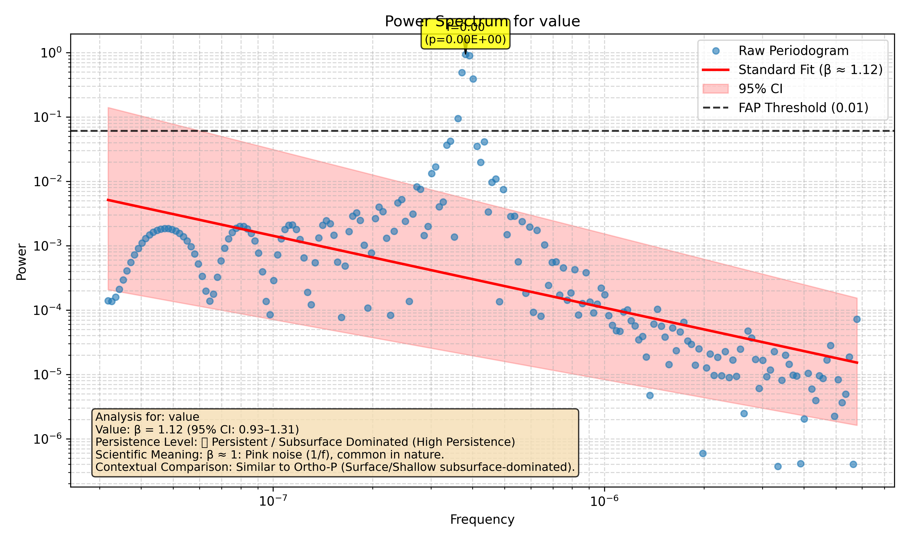

# Tutorial 7: Plotting and Visualization

A good analysis isn't complete until you have a good plot to show for it. `waterSpec`'s plotting function is designed to be an all-in-one visualization that tells the full story of your analysis.

### Step 1: Generating a Comprehensive Plot

Generating a plot is as simple as adding two arguments to the `run_analysis` function: `do_plot=True` and `output_path='your_filename.png'`.

Let's use the periodic signal we created in the last tutorial to generate a plot that has all the possible visual elements.

```python
from waterSpec import run_analysis

# We use the 'periodic_data.csv' file created in the previous tutorial.
file_path = 'examples/periodic_data.csv'
plot_path = 'docs/tutorials/07_anatomy_plot.png'

results = run_analysis(
    file_path=file_path,
    time_col='timestamp',
    data_col='value',
    detrend_method=None,
    fap_threshold=0.01,
    do_plot=True,
    output_path=plot_path
)

print(f"Plot saved to: {plot_path}")
```

### Step 2: Anatomy of a `waterSpec` Plot

The plot you just created contains a wealth of information. Let's break it down piece by piece.



1.  **The Raw Periodogram (Blue Circles)**: These are the fundamental data points of the plot. Each circle shows the calculated spectral power at a specific frequency.

2.  **The Spectral Fit (Red Line)**: This is the straight line fitted to the periodogram on a log-log scale. The slope of this line is used to calculate the spectral exponent (β).

3.  **The Confidence Interval (Shaded Red Area)**: This band represents the 95% confidence interval for the spectral fit. A wider band indicates more uncertainty in the estimate of β.

4.  **The FAP Threshold (Dashed Black Line)**: This is the statistical significance threshold. Any peak that rises above this line is considered statistically significant.

5.  **Significant Peaks (Yellow Annotated Boxes)**: These are the peaks that were found to be above the FAP threshold. They are annotated with their frequency (`f`) and their individual False Alarm Probability (`p`).

6.  **The Summary Box (Bottom-Left)**: This box contains the full, human-readable interpretation of the analysis, including the calculated β, its confidence interval, and a qualitative summary.

### The End of the Map

And that's it! With one function call, you get a publication-quality plot that summarizes every aspect of your spectral analysis. You are now ready to explore your own time series data with `waterSpec`!
