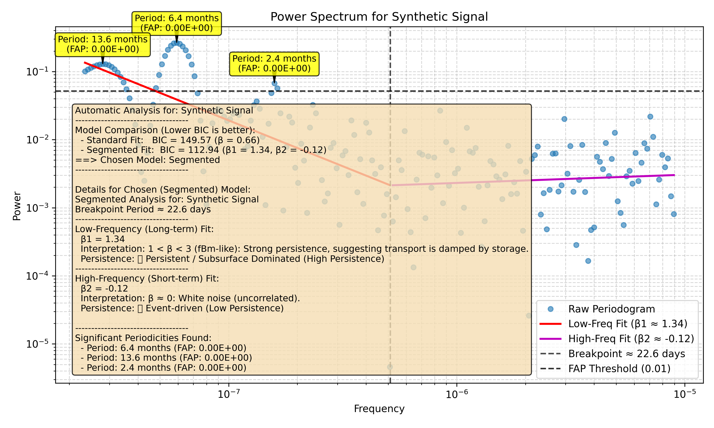

# Tutorial 8: Automatic Segmented Fitting

In some cases, a time series may not have a single scaling behavior. It might, for example, behave like random noise (β ≈ 0) at high frequencies but show strong persistence (β > 1) at low frequencies. This indicates a change in the underlying processes at different scales.

The `waterSpec` package automatically handles this for you. The `run_full_analysis` method will fit both a standard and a segmented model and use a statistical criterion (the BIC) to choose the best one.

### 1. Generating Synthetic Data with a Spectral Break

To see this in action, we need data with a known spectral break. The example script `run_segmented_fitting_example.py` generates such a signal by combining a persistent signal (Fractional Brownian Motion) with white noise.

### 2. Running the Automatic Analysis

We don't need to specify `analysis_type='segmented'` anymore. The `auto` mode (which is the only mode in `run_full_analysis`) does this for us.

Let's run the analysis on this special data.

```python
from waterSpec import Analysis

# This example uses data generated by a helper script.
# We will create a script to run this tutorial's code.
file_path = 'examples/run_segmented_fitting_example.py' # This is just a placeholder

analyzer = Analysis(
    file_path='examples/segmented_data.csv', # The script will create this file
    time_col='timestamp',
    data_col='value',
    param_name='Synthetic Signal'
)

results = analyzer.run_full_analysis(output_dir='docs/tutorials/segmented_outputs')

print("--- Analysis Results ---")
print(results['summary_text'])
```

### 3. Interpreting the Results

Because the synthetic data has a clear breakpoint, the automatic analysis will choose the segmented model. The output summary will reflect this choice and provide the details for both fitted segments.

The plot generated by the script visually confirms this, showing two distinct lines fitted to the power spectrum, with a clear "knee" at the breakpoint.



The text summary will look like this:

```text
Automatic Analysis for: Synthetic Signal
-----------------------------------
Model Comparison (Lower BIC is better):
  - Standard Fit:   BIC = 149.57 (β = 0.66)
  - Segmented Fit:  BIC = 112.94 (β1 = 1.34, β2 = -0.12)
==> Chosen Model: Segmented
-----------------------------------

Details for Chosen (Segmented) Model:
Segmented Analysis for: Synthetic Signal
Breakpoint Period ≈ 22.6 days
-----------------------------------
Low-Frequency (Long-term) Fit:
  β1 = 1.34
  Interpretation: 1 < β < 3 (fBm-like): Strong persistence, suggesting transport is damped by storage.
  Persistence: 🟢 Persistent / Subsurface Dominated (High Persistence)
-----------------------------------
High-Frequency (Short-term) Fit:
  β2 = -0.12
  Interpretation: β ≈ 0: White noise (uncorrelated).
  Persistence: 🔴 Event-driven (Low Persistence)

-----------------------------------
Significant Periodicities Found:
  - Period: 6.4 months (FAP: 0.00E+00)
  - Period: 13.6 months (FAP: 0.00E+00)
  - Period: 2.4 months (FAP: 0.00E+00)
```

This automatic model selection simplifies the workflow and provides a more statistically robust result without requiring the user to know in advance which model is appropriate for their data.
