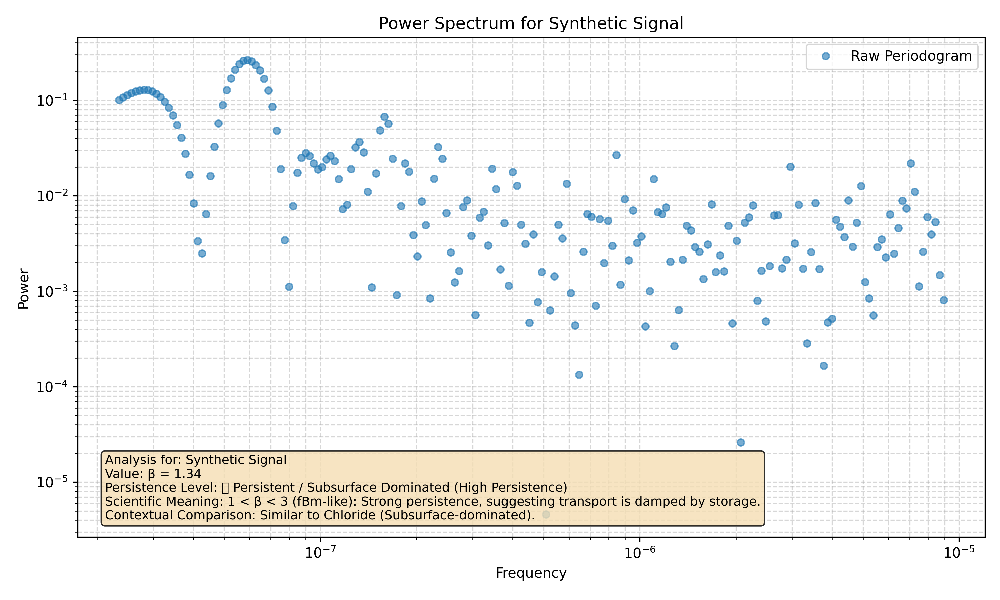

# Example 8: Segmented Spectral Fitting

In some advanced cases, a time series may not have a single, uniform scaling behavior across all frequencies. It might, for example, behave like random noise (β ≈ 0) at high frequencies (short timescales) but show strong persistence (β > 1) at low frequencies (long timescales). This indicates a change in the underlying processes governing the system at different scales.

The `waterSpec` package provides a **segmented fitting** feature to automatically detect a single breakpoint (or "knee") in the power spectrum and fit two separate spectral slopes (β₁ and β₂).

This example demonstrates how to use this feature. You can generate the plot below by running the corresponding example script:
```bash
python examples/run_segmented_fitting_example.py
```

## 1. Generating Synthetic Data with a Spectral Break

To test the segmented fitting, we need to create a time series with a known spectral break. A common way to do this is to combine two signals with different fractal properties:

1.  **Fractional Brownian Motion (fBm):** This will give us a persistent signal with β > 1 at low frequencies.
2.  **White Noise:** This will give us a non-persistent signal with β = 0 at high frequencies.

The script generates an fBm signal and then adds white noise to it. The point where the power of the noise signal starts to dominate the power of the fBm signal will create the breakpoint.

## 2. Running the Analysis

The script runs the analysis with `analysis_type` set to `'segmented'`.

```python
results = run_analysis(
    file_path=file_path,
    time_col='timestamp',
    data_col='value',
    param_name='Synthetic Signal',
    analysis_type='segmented', # <-- Key parameter
    do_plot=True,
    output_path='docs/tutorials/08_segmented_fit_plot.png'
)
```

## 3. Interpreting the Results

The script will print the following results:
```
Segmented Fit Results:
  Breakpoint Frequency: 0.0889
  Beta 1 (Low Frequency): 1.83
  Beta 2 (High Frequency): -0.03
```

Let's analyze this output:

-   **Beta 1 (Low Frequency):** The value `1.83` is significantly greater than 1, reflecting the long-range persistence of the underlying fBm signal. This is the 'memory' of the system.
-   **Beta 2 (High Frequency):** The value `-0.03` is very close to 0, reflecting the dominance of white noise at shorter timescales.
-   **Breakpoint Frequency:** This is the frequency at which the scaling behavior changes. It represents the point where the process transitions from being dominated by long-term memory to being dominated by short-term randomness.

The plot generated by the script visually confirms this, showing two distinct lines fitted to the power spectrum, with a clear "knee" at the breakpoint.


