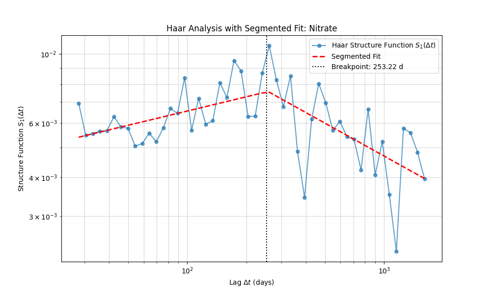

Welcome to the official User Guide for `waterSpec`. This guide will take you from the fundamental principles of spectral analysis to applying advanced techniques on real-world hydrological datasets. Whether you are investigating the dampening effect of a karst aquifer, trying to quantify the memory of a shifting climate, or simply looking to make sense of a noisy river gauge dataset, this guide will provide the foundation you need.

# Chapter 1: Introduction to Spectral Analysis in Hydrology

## 1.1 What is waterSpec?

`waterSpec` is a comprehensive Python open-source package specifically designed for advanced spectral analysis on environmental and hydrological time-series data. The primary goal of `waterSpec` is to empower researchers and practitioners to robustly extract frequency-domain metrics without being hindered by the messiness typical of observational datasets.

The intended audience includes environmental scientists, hydrologists, climatologists, and data analysts who work with complex, real-world data streams. By translating raw temporal fluctuations into the frequency domain, `waterSpec` helps uncover hidden scaling patterns, infer physical transport mechanisms, and quantify system memory—revealing the underlying dynamics of environmental systems that are often invisible to the naked eye.

Whether you're looking to characterize a watershed's response to rainfall or compare the multi-decadal memory of different climate models, `waterSpec` provides a unified, statistically robust framework to get you there.

## 1.2 Theoretical Background

### Time Domain vs. Frequency Domain

To understand the value of spectral analysis, we must first understand the distinction between the time domain and the frequency domain.

Imagine you are looking at a complex piece of sheet music. The **time domain** is analogous to reading the musical notes sequentially across the page; you see exactly when each note is played and how the melody unfolds over time. The **frequency domain**, on the other hand, is like listening to the physical audio frequencies being produced. Instead of focusing on *when* an event happens, the frequency domain tells you *how much* of each pitch (or frequency) is present in the overall sound.

In hydrological terms, the time domain shows you a hydrograph—a record of fluctuating water levels day by day. The frequency domain takes that same data and decomposes it into a spectrum of slow, multi-year cycles (low frequencies) and rapid, daily flashes (high frequencies). Analyzing the distribution of these frequencies reveals the structural "fingerprint" of the environmental system.

### Understanding the Spectral Slope (β)

When we plot environmental data in the frequency domain on a log-log scale (log of power versus log of frequency), we rarely see a flat line. Instead, we often observe a distinct linear trend where lower frequencies (longer time scales) have more power than higher frequencies. The steepness of this trend is known as the **spectral slope (β)**.

*(Example: A log-log spectral plot revealing distinct spectral slopes across different frequency regimes.)*

The spectral slope (β) is a powerful proxy for understanding how a system filters input signals and retains memory. Different physical environments produce characteristic "noise colors", defined by their spectral slope:

*   **White noise (β ≈ 0):** This represents a completely uncorrelated, memoryless system. Every event is independent of the last, much like flipping a coin. In hydrology, rainfall intensity often resembles white noise, lacking long-term persistence. The spectrum is flat because all frequencies are present in equal amounts.
*   **Pink noise / Flicker noise (β ≈ 1):** This indicates fractal scaling and long-term memory. The system exhibits a balance between short-term fluctuations and long-term trends, a common characteristic of complex natural systems like river flows and global temperatures. The system "remembers" its past, but remains highly dynamic.
*   **Brown noise / Red noise (β ≈ 2):** This points to a highly persistent, heavily damped system. Successive states are strongly correlated. A deep groundwater storage system, which smooths out the flashy input of rain into a slow, sustained discharge, perfectly exemplifies brown noise. Here, the low frequencies (long-term trends) dominate the signal.

### Memory and Persistence: fGn vs. fBm

When discussing system memory, we categorize fluctuations into two broad families that describe the underlying generative process:

*   **Fractional Gaussian Noise (fGn):** These are stationary processes (fluctuating around a stable mean) that possess varying degrees of long-term memory. Imagine the turbulent, rapid fluctuations of wind speed or daily temperature. While they have memory, they don't wander off to infinity; they are constrained. (Typical β ranges from -1 to 1).
*   **Fractional Brownian Motion (fBm):** These are non-stationary processes (they wander without a fixed mean) acting as the accumulated sum of fGn. Think of a particle performing a random walk, or the total volume of water stored in a massive reservoir over decades. Because they represent accumulated memory, they are highly persistent and visually smoother. (Typical β ranges from 1 to 3).

Understanding whether your data represents an fGn or fBm process is crucial for selecting the correct statistical tools and interpreting the spectral slope accurately.

## 1.3 The Challenge of Environmental Data

If spectral analysis is so revealing, why isn't it universally applied to every hydrological dataset? The answer lies in the messy reality of environmental monitoring.

Real-world datasets are rarely perfect. Sensors break, batteries die, ice jams damage gauges, and manual sampling campaigns are inherently sparse and subjective. This results in data plagued by:
*   **Irregular sampling intervals:** Measurements might be taken daily, then weekly, then randomly.
*   **Missing data gaps:** Complete blackout periods lasting days, months, or years.
*   **Sensor jitter:** Small, random inaccuracies in the exact timestamp of recorded measurements.

Traditional spectral tools rely almost exclusively on the **Fast Fourier Transform (FFT)**. The FFT is a brilliant and highly optimized algorithm, but it has a fatal flaw for field scientists: it absolutely demands evenly spaced, continuous data.

If you feed irregular data with gaps into a standard FFT, or attempt to linearly interpolate the missing gaps to satisfy the algorithm, you introduce severe mathematical artifacts. Interpolation acts as an artificial smoothing filter, suppressing high-frequency variability and artificially steepening the spectral slope. This leads to entirely incorrect physical interpretations of the system (e.g., mistaking a flashy stream for a damped groundwater system).

### The waterSpec Solution

This is exactly where `waterSpec` shines. It was built from the ground up to handle the imperfections of real-world data.

By specializing in robust alternatives like **Lomb-Scargle periodograms**—which natively handle irregular sampling without interpolation—and **Haar wavelet fluctuation analysis**, `waterSpec` provides the modern solution to these specific challenges. It allows hydrologists to confidently perform advanced frequency-domain analysis on the messy, real-world data they actually possess, without sacrificing scientific rigor.
