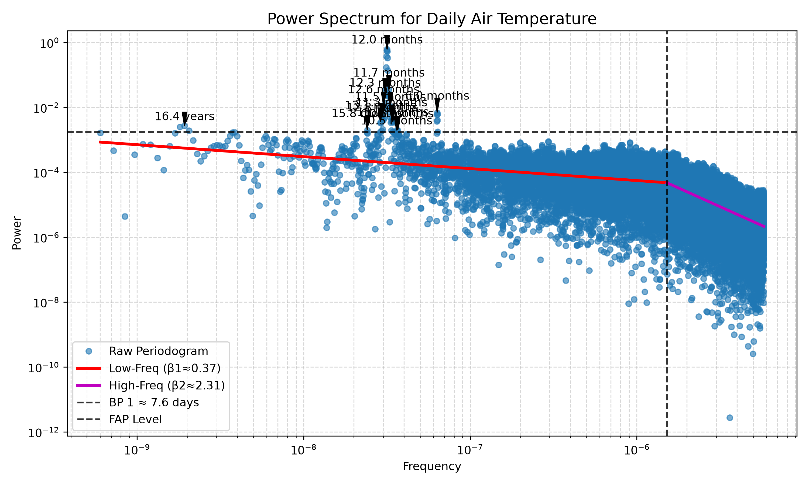
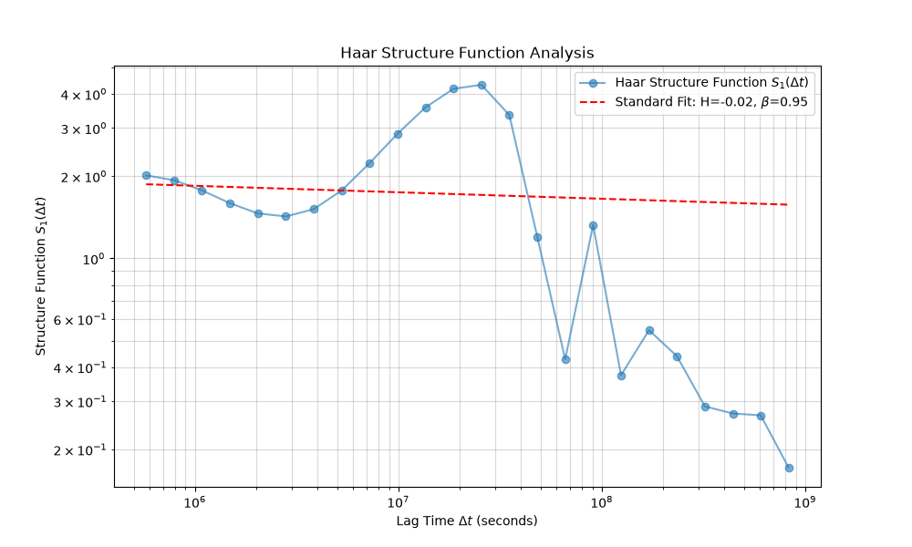

# waterSpec Analysis Report


## Data Characteristics


- Regularly Sampled: True


## Key Metrics

| Metric | Value |
| --- | --- |
| Haar Beta | 0.95 |
| LS Beta | 0.37 |


## Spectral Fits

```
Automatic Analysis for: Daily Air Temperature
-----------------------------------
Model Comparison (Lower BIC is better):
  - Segmented (1 BP) BIC = -55195.20 (β1=0.37, β2=2.31)

  Models that were mathematically unjustified or failed to converge:
    - Standard model (0 breakpoints): An unexpected error occurred during the initial standard model fit with method 'theil-sen': MemoryError((48008, 48008), dtype('float64'))

==> Chosen Model: Segmented 1bp
-----------------------------------

Details for Chosen (Segmented 1bp) Model:
Segmented Analysis for: Daily Air Temperature
Low-Frequency (Long-term) Fit:
  β1 = 0.37 (95% CI: 0.34–0.39 (parametric))
  Interpretation: 0 < β < 1 (fGn-like): Weakly persistent, suggesting short-term atmospheric variability.
  Persistence: Low (High-frequency variability)
--- Breakpoint 1 @ ~7.6 days (95% CI: 7.4 days–7.8 days (parametric)) ---
High-Frequency (Short-term) Fit:
  β2 = 2.31 (95% CI: 2.28–2.34 (parametric))
  Interpretation: 1 < β < 3.0 (fBm-like): Strong persistence, suggesting long-term climatic persistence.
  Persistence: High (Climatic memory)

-----------------------------------
Significant Periodicities Found (at 1.0% FAP Level):
  - Period: 12.0 months
  - Period: 11.7 months
  - Period: 12.3 months
  - Period: 12.6 months
  - Period: 11.5 months
  - Period: 6.0 months
  - Period: 12.8 months
  - Period: 11.3 months
  - Period: 11.1 months
  - Period: 13.1 months
  - Period: 16.4 years
  - Period: 15.8 months
  - Period: 10.5 months
  - Period: 10.3 months

-----------------------------------

Standard Analysis for: Daily Air Temperature (Haar Analysis) (N_eff ≈ 441.6)
Value: β = 0.95 (95% CI: 0.55–1.28 (bootstrap))
Persistence Level: Medium (Mixed)
Scientific Meaning: β ≈ 1 (Pink Noise): Stronger persistence, common in natural systems.


No significant periodicities were found.

-----------------------------------
Uncertainty Report:
  - Warning: The 95% CI for β is wide (0.73 > 0.5), suggesting high uncertainty.
```


## Visualizations


### Spectrum





### Haar



