# Comprehensive Spectral Analysis Report

This report summarizes the spectral analysis of various datasets using Lomb-Scargle and Haar Wavelet methods.

## Summary Table

| Dataset | Type | Expected Beta | LS Beta | Haar Beta |
| :--- | :--- | :--- | :--- | :--- |
| hadcrut4 | original | 0.65 | 0.85 | 0.76 |
| hadcrut4 | uneven | 0.65 | 0.24 | 0.86 |
| sp500 | original | 2.0 | 0.32 | 2.02 |
| sp500 | uneven | 2.0 | 0.18 | 1.96 |
| mitbih | original | 1.0 | -0.18 | 0.26 |
| mitbih | uneven | 1.0 | -0.11 | 0.23 |
| midi | original | 1.0 | 0.28 | 0.53 |
| midi | uneven | 1.0 | 0.28 | 0.53 |

## Detailed Results

### HADCRUT4

#### Original Sampling
- **Expected Beta**: 0.65
- **Lomb-Scargle Beta**: 0.85
- **Haar Beta**: 0.76

**Plots:**

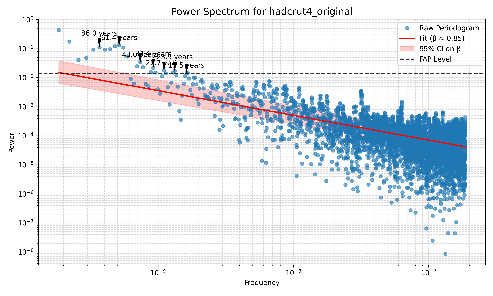
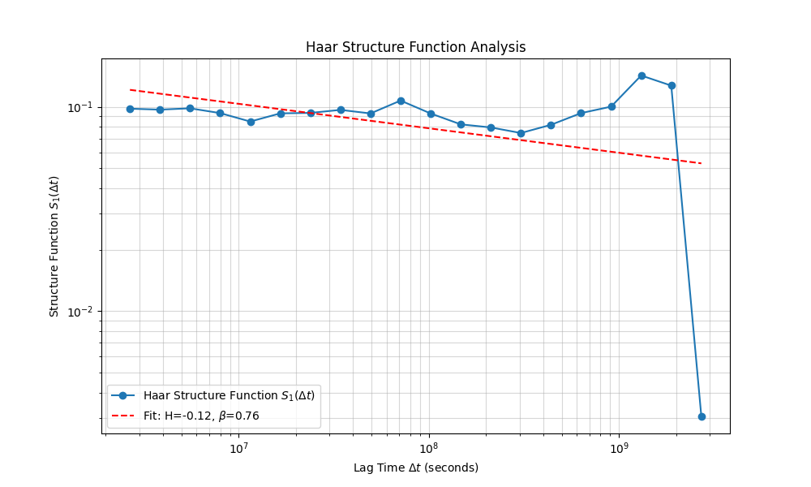

---
#### Uneven Sampling
- **Expected Beta**: 0.65
- **Lomb-Scargle Beta**: 0.24
- **Haar Beta**: 0.86

**Plots:**

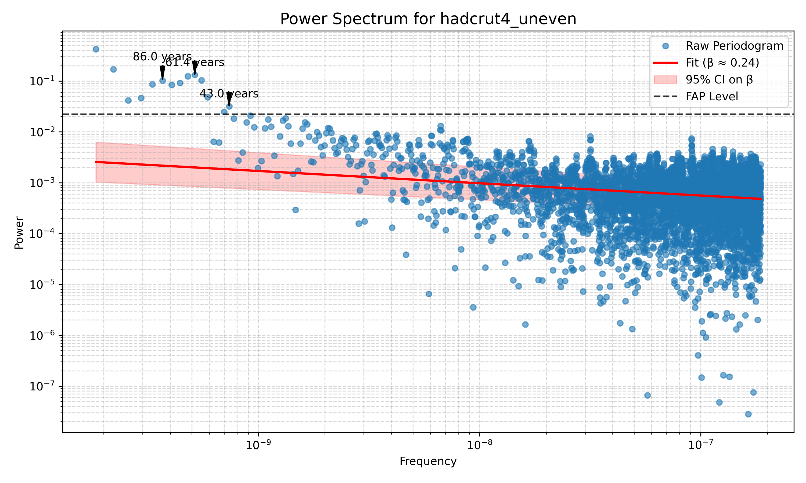

---
### SP500

#### Original Sampling
- **Expected Beta**: 2.0
- **Lomb-Scargle Beta**: 0.32
- **Haar Beta**: 2.02

**Plots:**

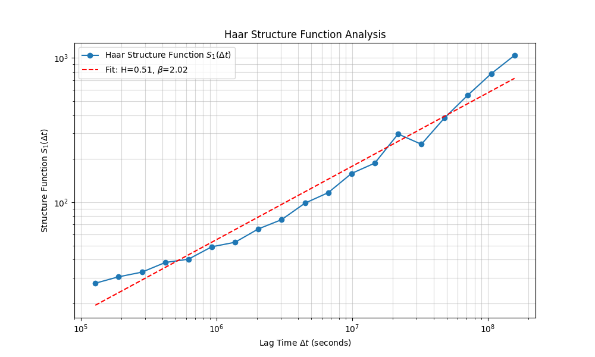

---
#### Uneven Sampling
- **Expected Beta**: 2.0
- **Lomb-Scargle Beta**: 0.18
- **Haar Beta**: 1.96

**Plots:**

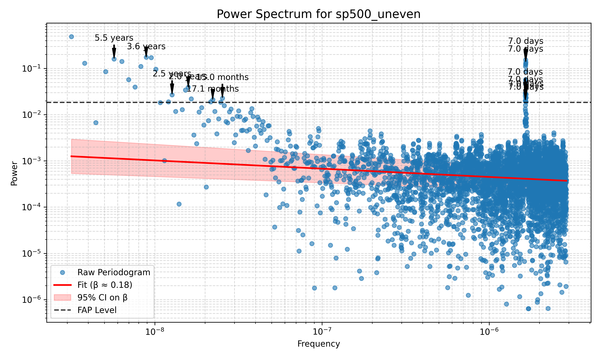
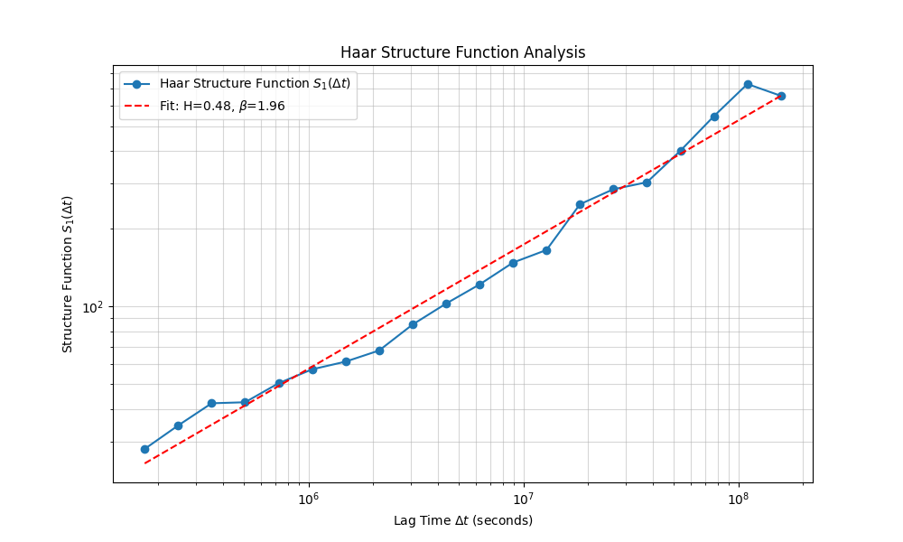

---
### MITBIH

#### Original Sampling
- **Expected Beta**: 1.0
- **Lomb-Scargle Beta**: -0.18
- **Haar Beta**: 0.26

**Plots:**

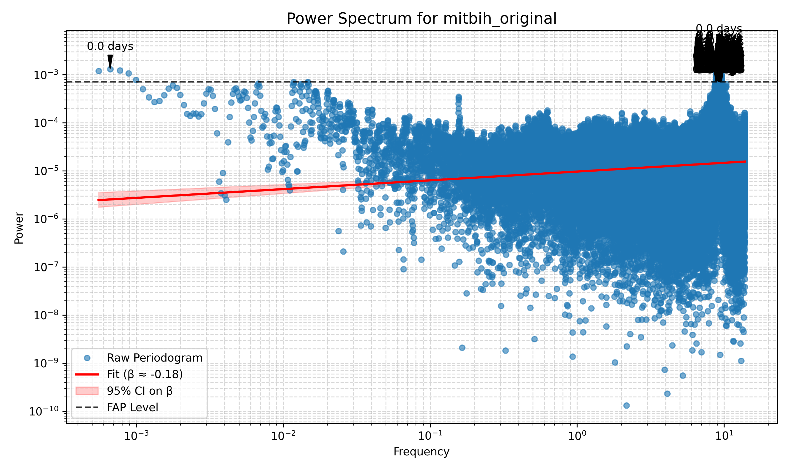
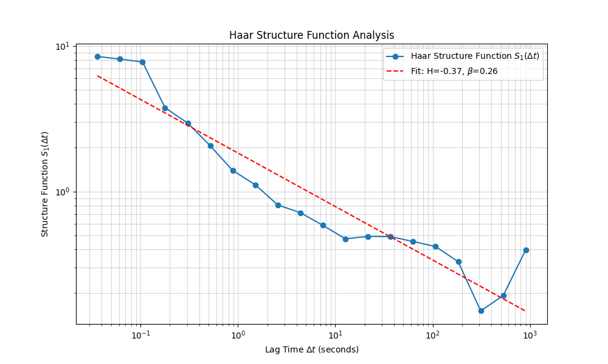

---
#### Uneven Sampling
- **Expected Beta**: 1.0
- **Lomb-Scargle Beta**: -0.11
- **Haar Beta**: 0.23

**Plots:**

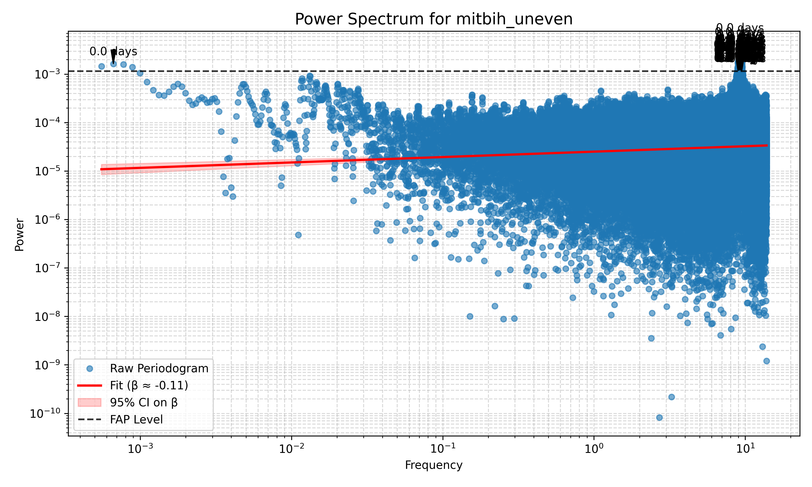
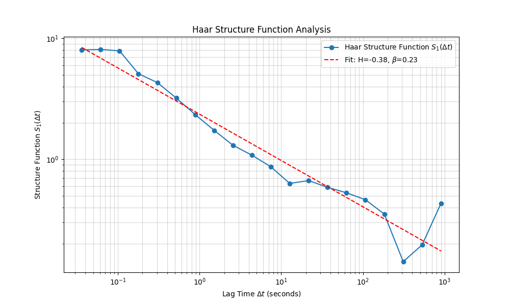

---
### MIDI

#### Original Sampling
- **Expected Beta**: 1.0
- **Lomb-Scargle Beta**: 0.28
- **Haar Beta**: 0.53

**Plots:**

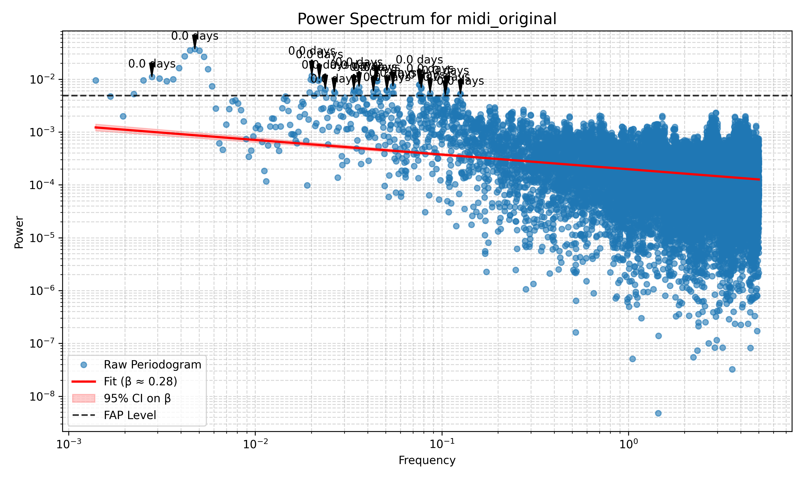
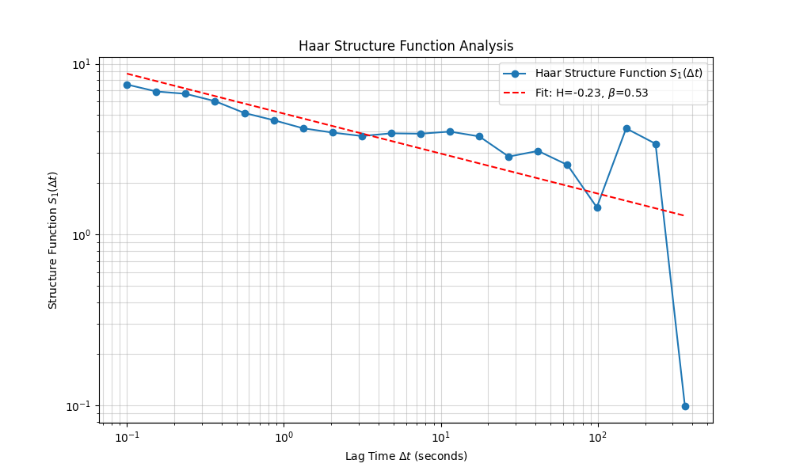

---
#### Uneven Sampling
- **Expected Beta**: 1.0
- **Lomb-Scargle Beta**: 0.28
- **Haar Beta**: 0.53

**Plots:**

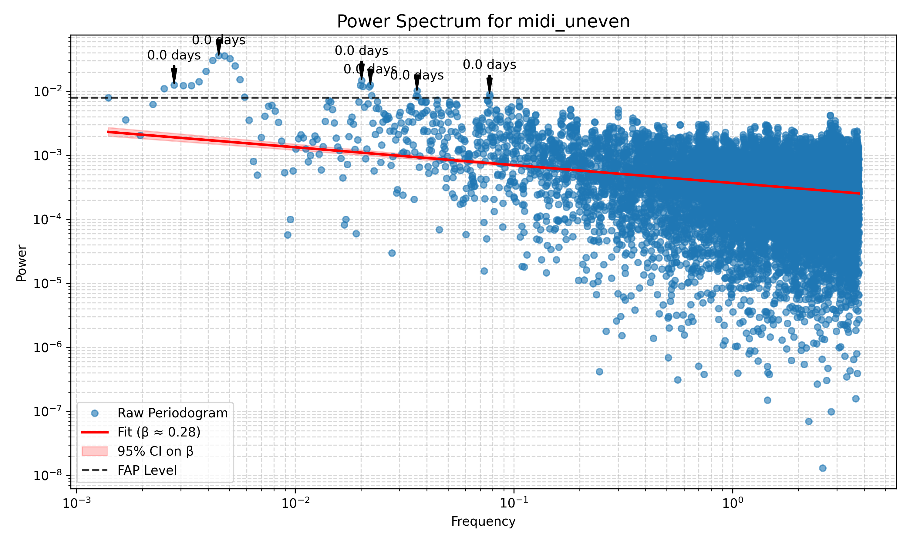
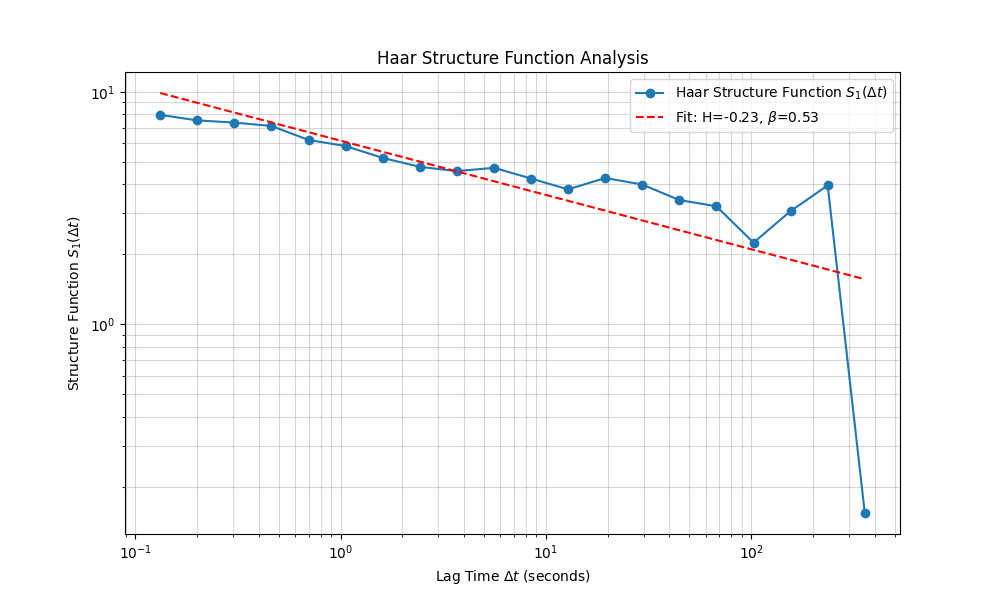

---
