# Haar Analysis Results (Segmented Fit)

Analysis performed on data files in `assets/data/`.

## Air Quality (PM)
- **File:** `Daily_air_quality.xlsx`
- **Data Points:** 3186
- **Breakpoints Found:** 1
- **Breakpoint Location:** 243.23 days

**Spectral Slopes:**

| Regime | Haar Exponent (H) | Spectral Slope (β) |
| :--- | :--- | :--- |
| High Freq (Short-term) | -0.152 | 0.697 |
| Low Freq (Long-term) | -0.809 | -0.617 |

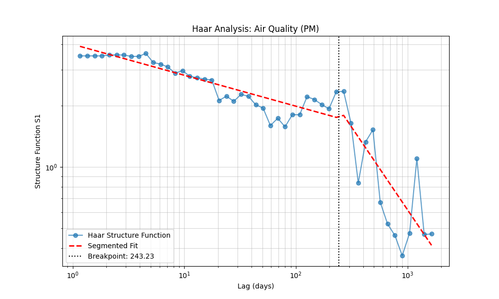

---
## Site 1 NH4
- **File:** `Site_1_NH4.xlsx`
- **Data Points:** 233
- **Breakpoints Found:** 1
- **Breakpoint Location:** 2212.54 days

**Spectral Slopes:**

| Regime | Haar Exponent (H) | Spectral Slope (β) |
| :--- | :--- | :--- |
| High Freq (Short-term) | -0.121 | 0.758 |
| Low Freq (Long-term) | 1.438 | 3.875 |

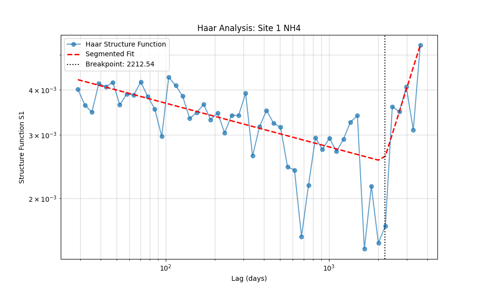

---
## Site 1 NO3
- **File:** `Site_1_NO3.xlsx`
- **Data Points:** 73
- **Breakpoints Found:** 1
- **Breakpoint Location:** 253.22 days

**Spectral Slopes:**

| Regime | Haar Exponent (H) | Spectral Slope (β) |
| :--- | :--- | :--- |
| High Freq (Short-term) | 0.153 | 1.306 |
| Low Freq (Long-term) | -0.353 | 0.294 |

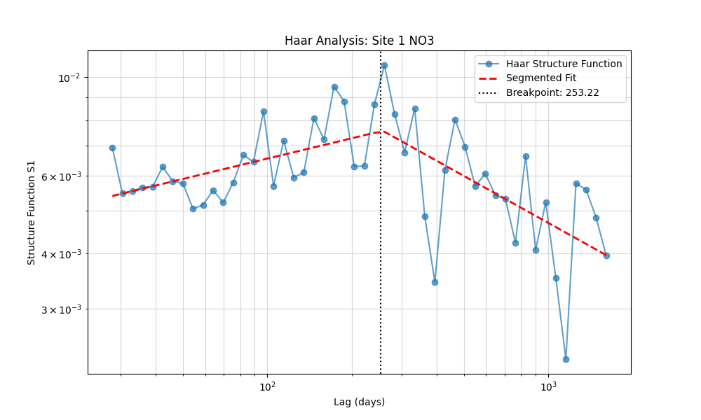

---
## Site 1 TN
- **File:** `Site_1_TN.xlsx`
- **Data Points:** 190
- **Breakpoints Found:** 1
- **Breakpoint Location:** 122.95 days

**Spectral Slopes:**

| Regime | Haar Exponent (H) | Spectral Slope (β) |
| :--- | :--- | :--- |
| High Freq (Short-term) | -0.079 | 0.843 |
| Low Freq (Long-term) | -0.269 | 0.462 |

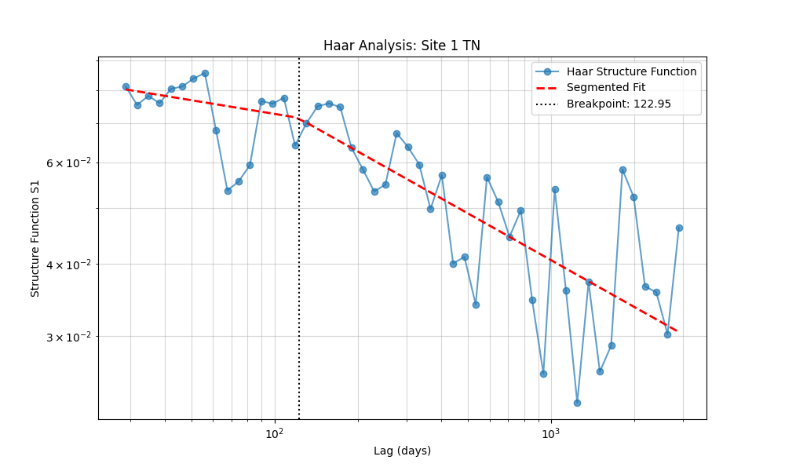

---
## Site 1 TP
- **File:** `Site_1_TP.xlsx`
- **Data Points:** 235
- **Breakpoints Found:** 1
- **Breakpoint Location:** 385.71 days

**Spectral Slopes:**

| Regime | Haar Exponent (H) | Spectral Slope (β) |
| :--- | :--- | :--- |
| High Freq (Short-term) | -0.078 | 0.845 |
| Low Freq (Long-term) | -0.372 | 0.255 |

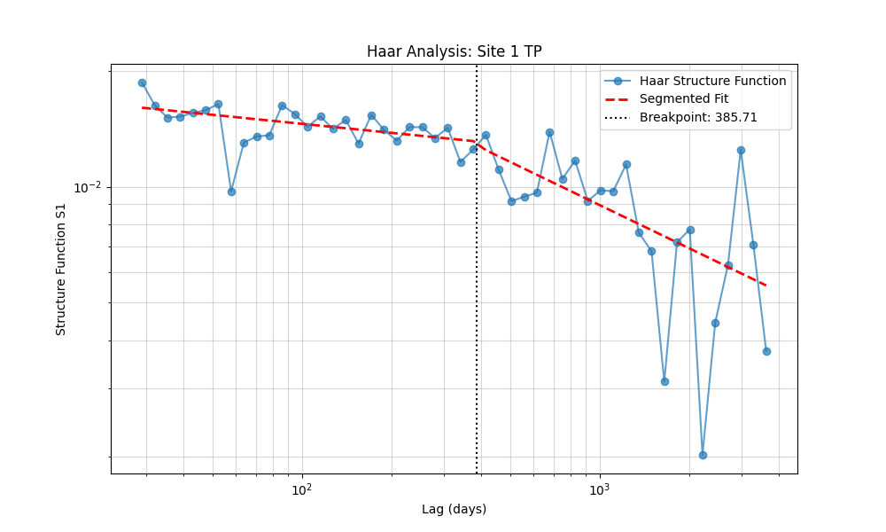

---
## Site 1 ecoli
- **File:** `Site_1_ecoli.xlsx`
- **Data Points:** 217
- **Breakpoints Found:** 1
- **Breakpoint Location:** 53.83 days

**Spectral Slopes:**

| Regime | Haar Exponent (H) | Spectral Slope (β) |
| :--- | :--- | :--- |
| High Freq (Short-term) | -0.295 | 0.409 |
| Low Freq (Long-term) | 0.033 | 1.066 |

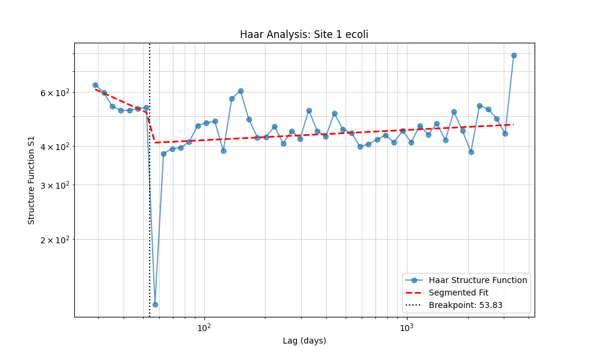

---
## Site 2 NH4
- **File:** `Site_2_NH4.xlsx`
- **Data Points:** 191
- **Breakpoints Found:** 1
- **Breakpoint Location:** 214.52 days

**Spectral Slopes:**

| Regime | Haar Exponent (H) | Spectral Slope (β) |
| :--- | :--- | :--- |
| High Freq (Short-term) | -0.160 | 0.681 |
| Low Freq (Long-term) | -0.397 | 0.207 |

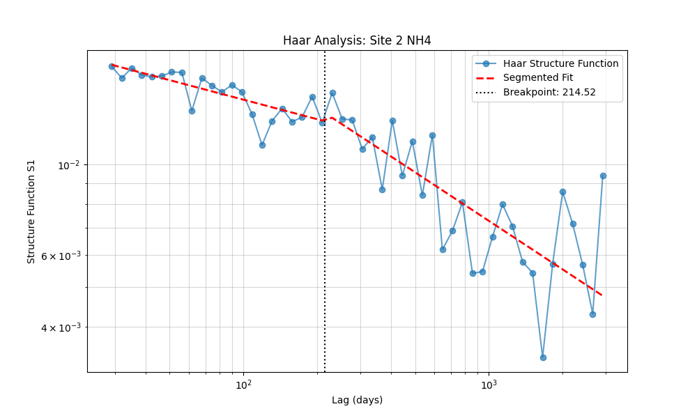

---
## Site 2 NO3
- **File:** `Site_2_NO3.xlsx`
- **Data Points:** 74
- **Breakpoints Found:** 1
- **Breakpoint Location:** 174.85 days

**Spectral Slopes:**

| Regime | Haar Exponent (H) | Spectral Slope (β) |
| :--- | :--- | :--- |
| High Freq (Short-term) | 0.221 | 1.443 |
| Low Freq (Long-term) | -0.391 | 0.218 |

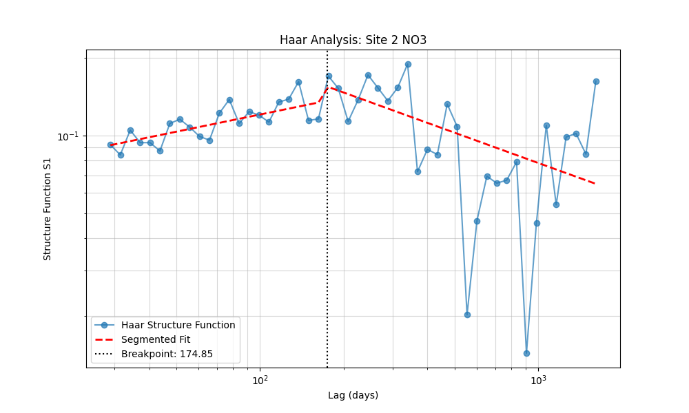

---
## Site 2 TN
- **File:** `Site_2_TN.xlsx`
- **Data Points:** 191
- **Breakpoints Found:** 1
- **Breakpoint Location:** 1017.64 days

**Spectral Slopes:**

| Regime | Haar Exponent (H) | Spectral Slope (β) |
| :--- | :--- | :--- |
| High Freq (Short-term) | -0.169 | 0.662 |
| Low Freq (Long-term) | 0.401 | 1.801 |

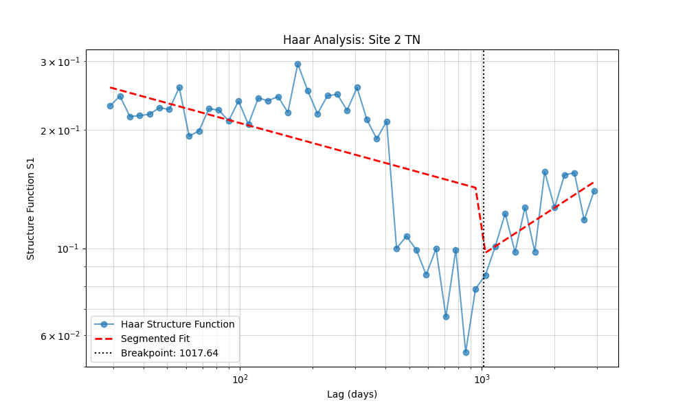

---
## Site 2 TP
- **File:** `Site_2_TP.xlsx`
- **Data Points:** 191
- **Breakpoints Found:** 1
- **Breakpoint Location:** 1422.68 days

**Spectral Slopes:**

| Regime | Haar Exponent (H) | Spectral Slope (β) |
| :--- | :--- | :--- |
| High Freq (Short-term) | -0.189 | 0.621 |
| Low Freq (Long-term) | 0.320 | 1.640 |

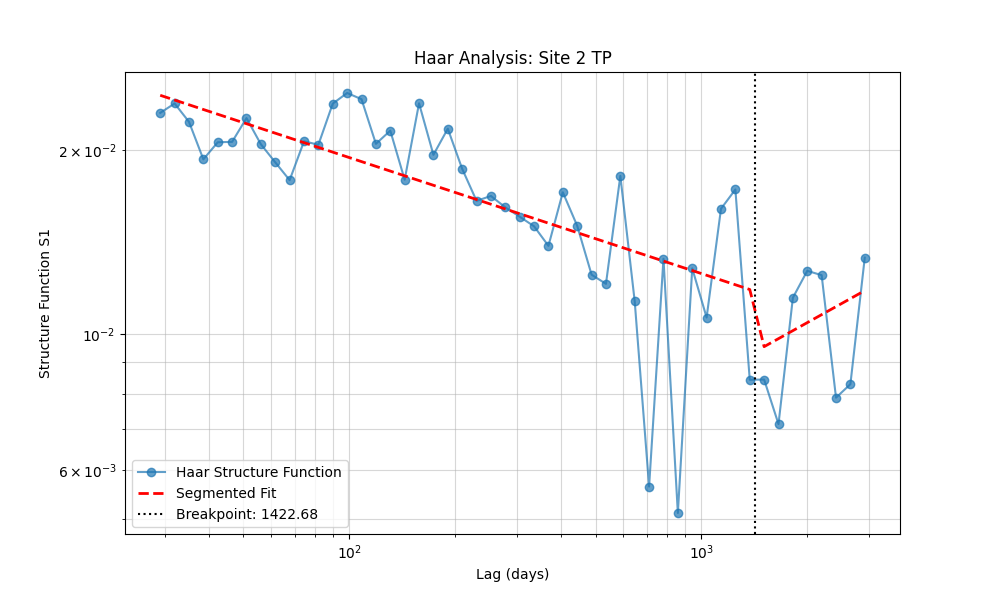

---
## Site 2 ecoli
- **File:** `Site_2_ecoli.xlsx`
- **Data Points:** 191
- **Breakpoints Found:** 1
- **Breakpoint Location:** 654.16 days

**Spectral Slopes:**

| Regime | Haar Exponent (H) | Spectral Slope (β) |
| :--- | :--- | :--- |
| High Freq (Short-term) | -0.065 | 0.870 |
| Low Freq (Long-term) | -0.558 | -0.115 |

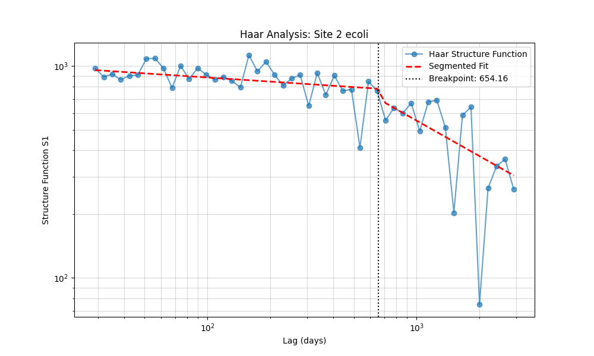

---
## Site 3 NH4
- **File:** `Site_3_NH4.xlsx`
- **Data Points:** 237
- **Breakpoints Found:** 1
- **Breakpoint Location:** 1357.58 days

**Spectral Slopes:**

| Regime | Haar Exponent (H) | Spectral Slope (β) |
| :--- | :--- | :--- |
| High Freq (Short-term) | -0.212 | 0.576 |
| Low Freq (Long-term) | 0.409 | 1.817 |

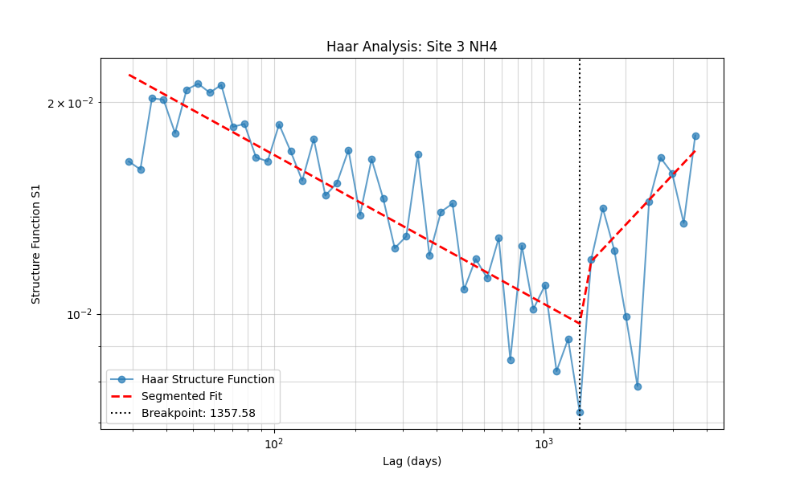

---
## Site 3 NO3
- **File:** `Site_3_NO3.xlsx`
- **Data Points:** 73
- **Breakpoints Found:** 1
- **Breakpoint Location:** 1000.83 days

**Spectral Slopes:**

| Regime | Haar Exponent (H) | Spectral Slope (β) |
| :--- | :--- | :--- |
| High Freq (Short-term) | -0.323 | 0.355 |
| Low Freq (Long-term) | 2.165 | 5.330 |

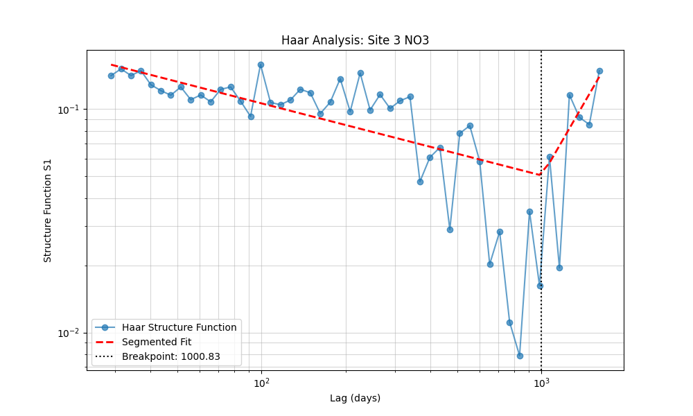

---
## Site 3 TN
- **File:** `Site_3_TN.xlsx`
- **Data Points:** 191
- **Breakpoints Found:** 1
- **Breakpoint Location:** 2566.56 days

**Spectral Slopes:**

| Regime | Haar Exponent (H) | Spectral Slope (β) |
| :--- | :--- | :--- |
| High Freq (Short-term) | -0.322 | 0.355 |
| Low Freq (Long-term) | -11.116 | -21.233 |

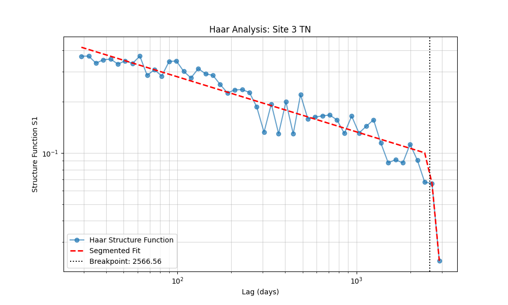

---
## Site 3 TP
- **File:** `Site_3_TP.xlsx`
- **Data Points:** 239
- **Breakpoints Found:** 1
- **Breakpoint Location:** 1427.42 days

**Spectral Slopes:**

| Regime | Haar Exponent (H) | Spectral Slope (β) |
| :--- | :--- | :--- |
| High Freq (Short-term) | -0.262 | 0.476 |
| Low Freq (Long-term) | 0.832 | 2.664 |

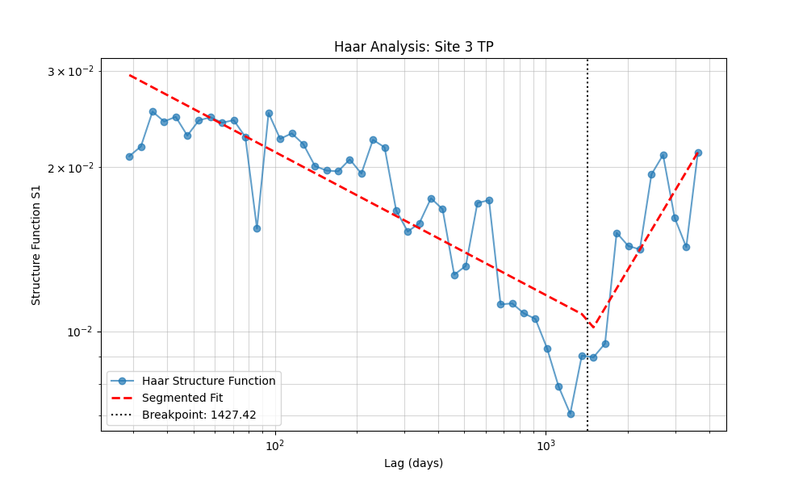

---
## Site 3 ecoli
- **File:** `Site_3_ecoli.xlsx`
- **Data Points:** 221
- **Breakpoints Found:** 1
- **Breakpoint Location:** 2410.16 days

**Spectral Slopes:**

| Regime | Haar Exponent (H) | Spectral Slope (β) |
| :--- | :--- | :--- |
| High Freq (Short-term) | -0.267 | 0.466 |
| Low Freq (Long-term) | -3.942 | -6.884 |

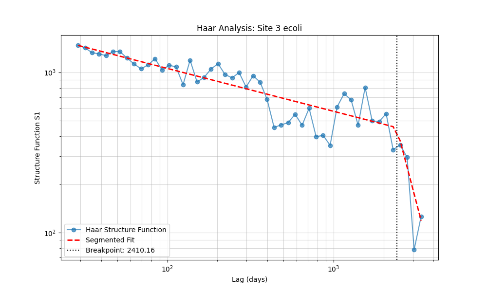

---
## AgrHys Nitrate
- **File:** `es403723r_si_002.xls`
- **Data Points:** 2966
- **Breakpoints Found:** 1
- **Breakpoint Location:** 209.36 days

**Spectral Slopes:**

| Regime | Haar Exponent (H) | Spectral Slope (β) |
| :--- | :--- | :--- |
| High Freq (Short-term) | 0.041 | 1.081 |
| Low Freq (Long-term) | -0.745 | -0.490 |

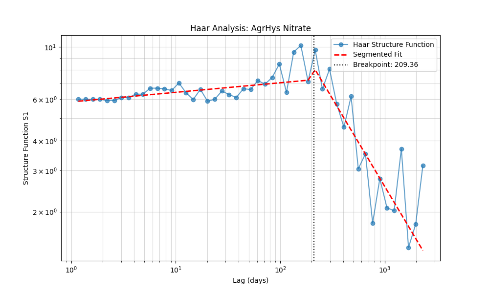

---
