# Validation Report: Beta Estimation Accuracy

This report validates the accuracy of the spectral exponent (β) estimation performed by the `waterSpec` package.

## Methodology

A Python script (`examples/validate_beta_estimation.py`) was used to perform the following steps for a range of known β values:

1.  **Generate Synthetic Data**: A synthetic time series of 2048 data points was generated with a known spectral exponent (β) using an inverse Fourier transform method.
2.  **Run Analysis**: The `waterSpec.run_analysis` function was executed on this synthetic data. Detrending was disabled to ensure the underlying spectral properties were not altered.
3.  **Compare Results**: The estimated β value from the analysis was compared to the known β value used to generate the data.

## Results Table

| Known Beta | Estimated Beta | 95% CI          | Difference |
|------------|----------------|-----------------|------------|
|      -0.25 |          -0.10 | [-0.15–-0.05]   |       0.15 |
|       0.00 |           0.03 | [-0.03–0.11]    |       0.03 |
|       0.25 |           0.27 | [0.23–0.33]     |       0.02 |
|       0.50 |           0.57 | [0.52–0.61]     |       0.07 |
|       0.75 |           0.80 | [0.73–0.84]     |       0.05 |
|       1.00 |           1.04 | [0.99–1.10]     |       0.04 |
|       1.25 |           1.15 | [1.08–1.20]     |      -0.10 |
|       1.50 |           1.52 | [1.48–1.56]     |       0.02 |
|       1.75 |           1.84 | [1.78–1.91]     |       0.09 |
|       2.00 |           2.04 | [2.00–2.08]     |       0.04 |
|       2.25 |           2.21 | [2.16–2.26]     |      -0.04 |
|       2.50 |           2.39 | [2.31–2.45]     |      -0.11 |
|       2.75 |           2.21 | [2.13–2.29]     |      -0.54 |
|       3.00 |           2.20 | [2.11–2.26]     |      -0.80 |

## Analysis Plots

### Known Beta = -0.25
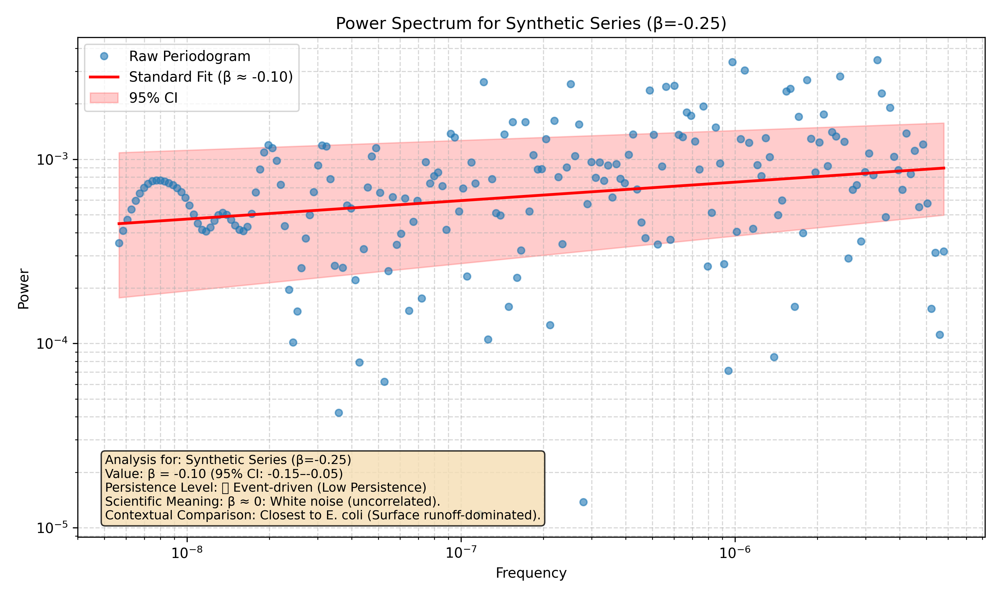

### Known Beta = 0.00
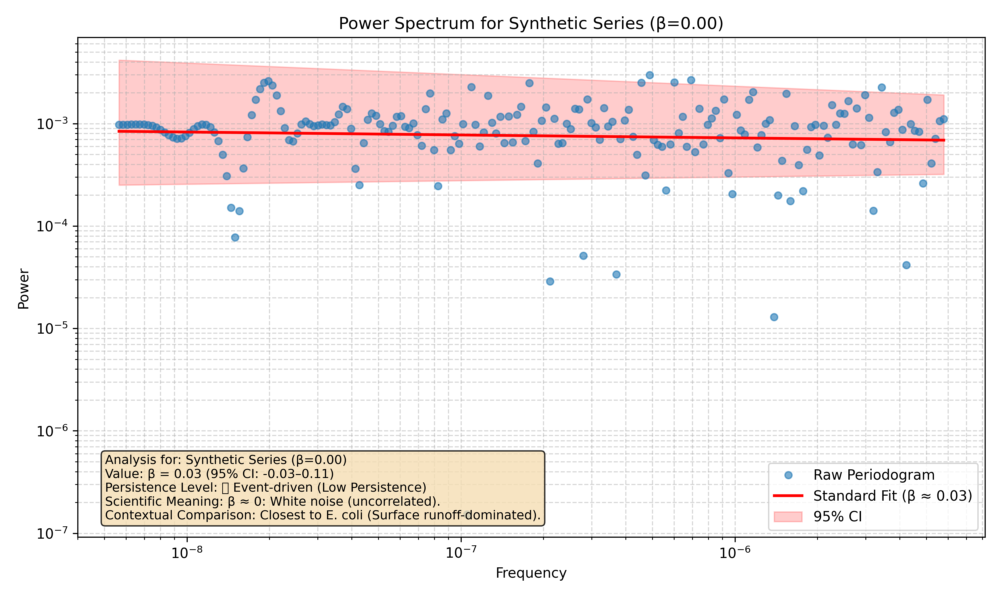

### Known Beta = 0.25
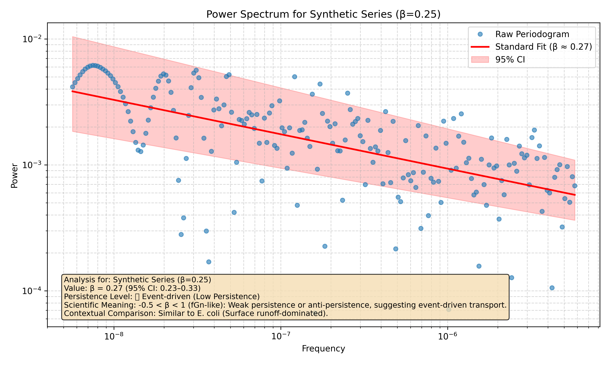

### Known Beta = 0.50
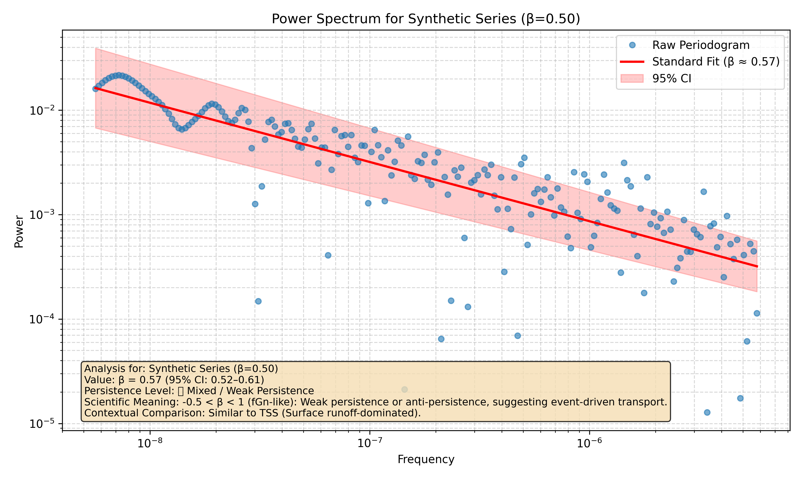

### Known Beta = 0.75
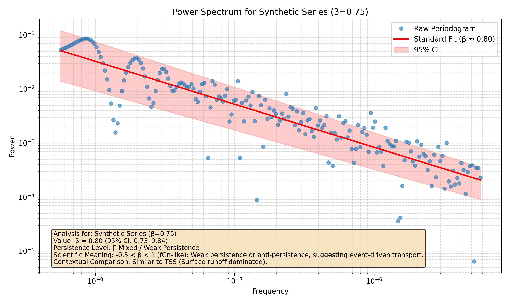

### Known Beta = 1.00
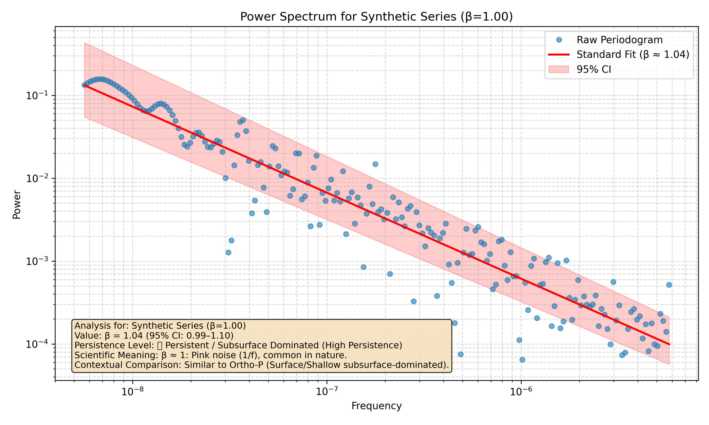

### Known Beta = 1.25
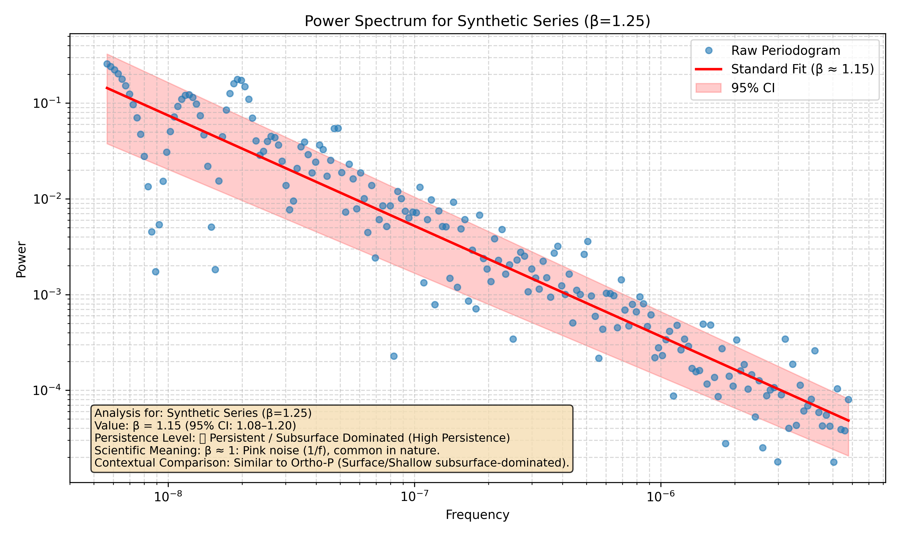

### Known Beta = 1.50
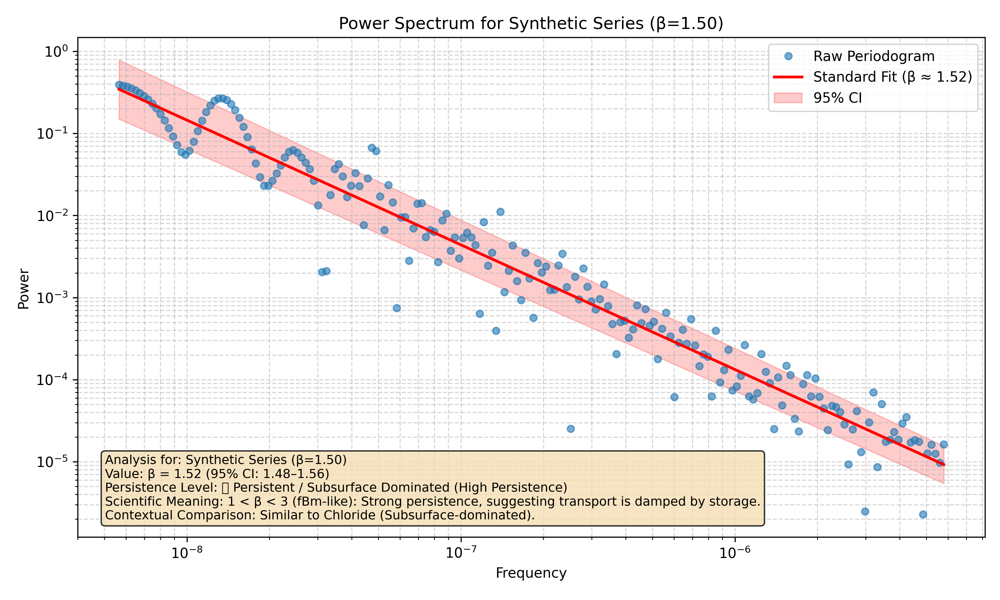

### Known Beta = 1.75

### Known Beta = 2.00
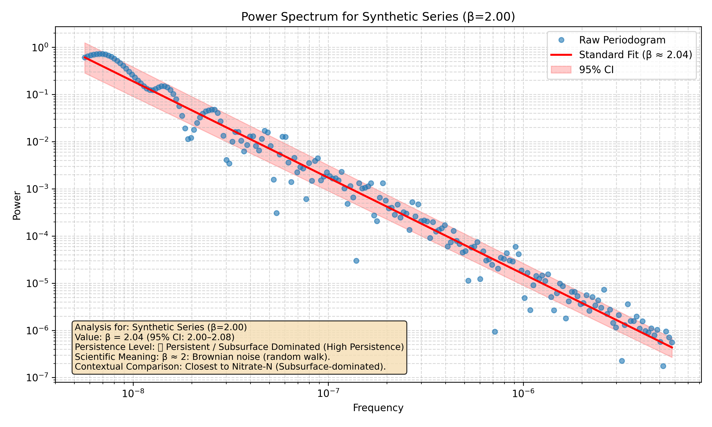

### Known Beta = 2.25
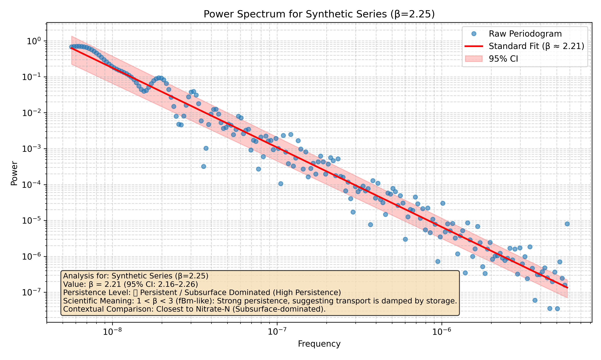

### Known Beta = 2.50
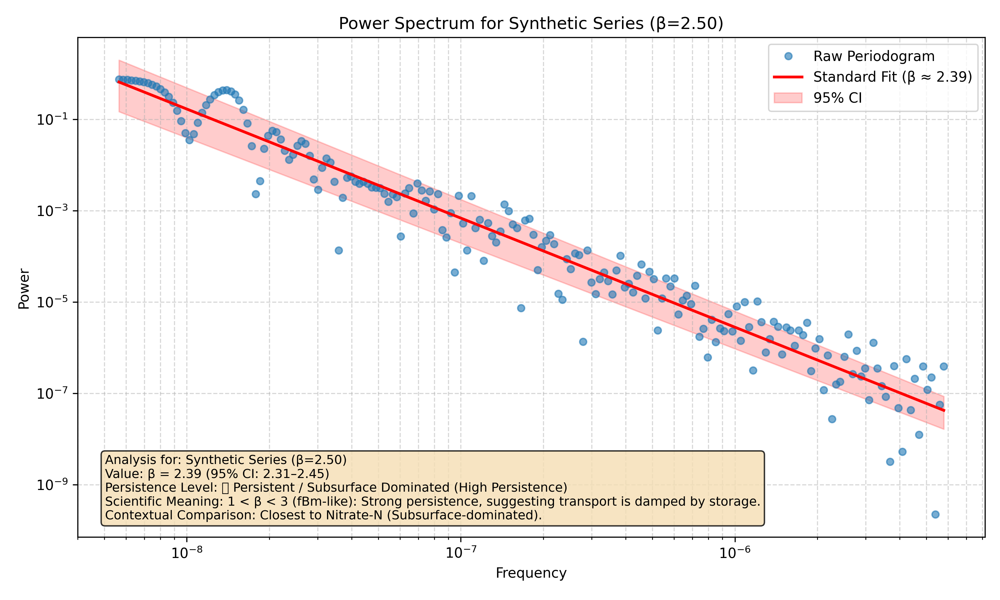

### Known Beta = 2.75
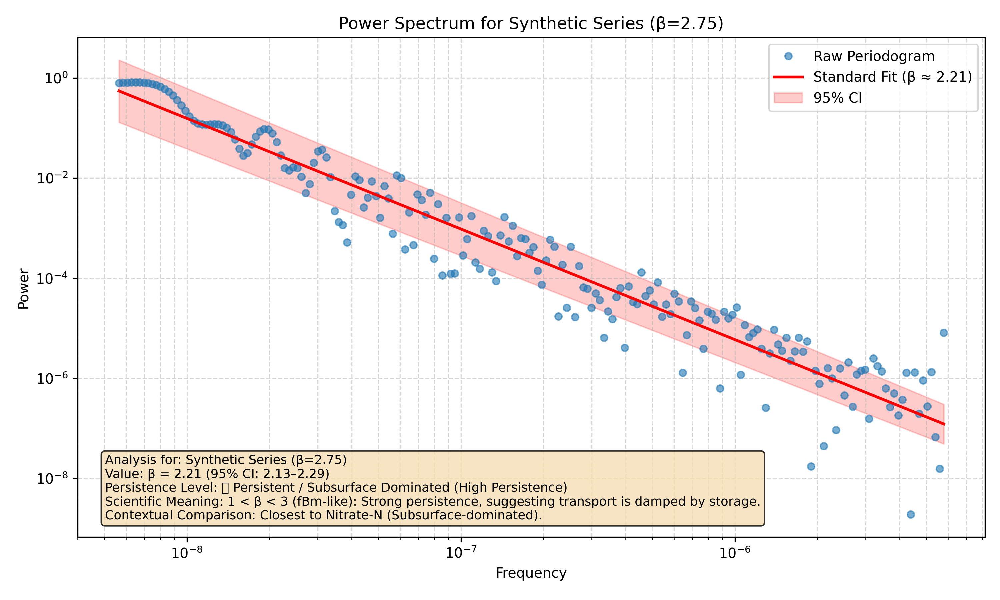

### Known Beta = 3.00
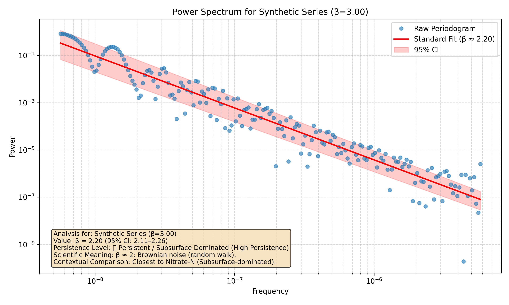
